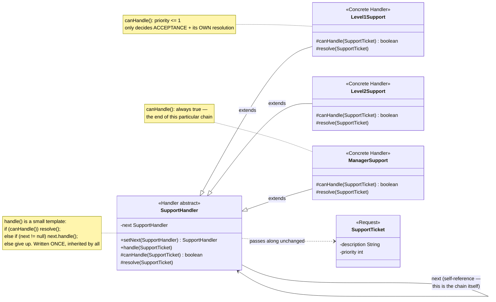
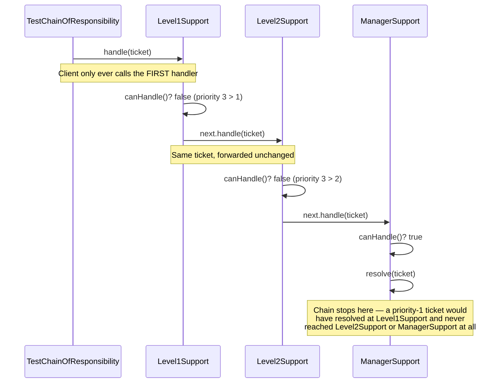

# Chain of Responsibility Design Pattern

[← Not sure this is the right pattern? See the decision tree](../../../../PATTERN_DECISION_TREE.md) ·
[quick reference for all 23](../../../../PATTERN_DECISION_TREE.md#every-pattern-grouped-by-pattern)

*Example: a support-ticket escalation chain — a Head-First-style example
built for this repo. Head First Design Patterns only covers Chain of
Responsibility briefly, in its "leftover patterns" chapter, without a fully
worked example, so this isn't a verbatim book example.*

## What it is
Chain of Responsibility avoids coupling the sender of a request to its
receiver by giving more than one object a chance to handle the request.
Handlers are chained together, and the request travels along the chain until
some handler resolves it.

## Problem it solves
Support tickets come in at different complexity levels — a forgotten
password should be handled immediately by tier-1 support, a billing dispute
needs a manager. Without this pattern, whoever submits a ticket would need to
know in advance exactly which support tier can handle it, and that decision
logic (`if priority <= 1 use Level1, else if <= 2 use Level2, else ...`) would
have to live somewhere central and grow every time a new tier is added. Chain
of Responsibility lets each handler decide independently whether it can
resolve a ticket, and simply pass it along if not — the sender just hands the
ticket to the first handler and doesn't care which one ends up resolving it.

## Participants (mapped to this package)

| Role                | Type            | Class in this package                                  |
|---------------------|-----------------|-----------------------------------------------------------|
| Handler (abstract)    | abstract class  | `SupportHandler`                                          |
| Concrete Handler      | class           | `Level1Support`, `Level2Support`, `ManagerSupport`         |
| Request               | class           | `SupportTicket`                                            |
| Client                | class           | `TestChainOfResponsibility`                                |

- **Handler (`SupportHandler`)** — holds a reference to the *next* handler in
  the chain and implements `handle(ticket)` as a small template: try
  `canHandle()`, and if it returns false, forward to `next` (or report
  nothing could handle it, if this is the last link).
- **Concrete Handlers (`Level1Support`, `Level2Support`, `ManagerSupport`)** —
  each only implements `canHandle()` (its own acceptance rule) and
  `resolve()` (what it does once it accepts a ticket).
- **Request (`SupportTicket`)** — the object passed along the chain unchanged.
- **Client (`TestChainOfResponsibility`)** — wires the handlers into a chain
  once (`level1.setNext(level2).setNext(manager)`), then only ever calls
  `handle()` on the first handler.

## Diagrams

*These two diagrams are meant to be readable on their own — every box is
labeled with its pattern role, and notes spell out what each one actually
does, so you shouldn't need the prose above to follow them.*

### UML class diagram



**How to read this:** the self-referencing arrow (`SupportHandler --> SupportHandler`)
is the whole mechanism — each handler holds a reference to the *next* one,
forming a linked list at runtime. `handle()` is written exactly once on the
base class; concrete handlers only ever implement `canHandle()` and
`resolve()`, nothing about forwarding.

### Workflow (sequence diagram — priority-3 ticket)



## Architecture / Flow

```
                    SupportHandler (abstract)
                    ---------------------------------
                    - next : SupportHandler
                    + setNext(SupportHandler) : SupportHandler
                    + handle(SupportTicket) {
                         if (canHandle(ticket)) resolve(ticket);
                         else if (next != null) next.handle(ticket);
                         else "no handler could resolve it"
                      }
                    # abstract canHandle(SupportTicket) : boolean
                    # abstract resolve(SupportTicket)
                       ▲                  ▲                   ▲
                       │                  │                   │
                Level1Support      Level2Support       ManagerSupport
              canHandle: priority<=1  canHandle: priority<=2   canHandle: always true
```

### Chain shape used in the demo

```
level1 --setNext--> level2 --setNext--> manager --(end of chain)
```

### Step-by-step call flow (a priority-3 ticket)

1. `level1.handle(ticket)` — the client only ever calls the *first* handler.
2. `Level1Support.canHandle(ticket)` checks `priority <= 1` → `false` (this
   ticket is priority 3). `SupportHandler.handle()` forwards to `next`.
3. `level2.handle(ticket)` — same ticket, now being tried by
   `Level2Support`. `canHandle()` checks `priority <= 2` → still `false`.
   Forwards again.
4. `manager.handle(ticket)` — `ManagerSupport.canHandle()` always returns
   `true`, so it resolves the ticket here, and the chain stops.

```
TestChainOfResponsibility --> level1.handle(ticket)
Level1Support.handle(ticket)
   ├──> canHandle(ticket)?  false (priority 3 > 1)
   └──> next.handle(ticket)                [forwards to Level2Support]
            Level2Support.handle(ticket)
               ├──> canHandle(ticket)?  false (priority 3 > 2)
               └──> next.handle(ticket)     [forwards to ManagerSupport]
                        ManagerSupport.handle(ticket)
                           ├──> canHandle(ticket)?  true
                           └──> resolve(ticket)     [chain stops here]
```

A priority-1 ticket resolves immediately at `Level1Support` and never even
reaches `Level2Support` — each handler only does as much escalation as the
ticket actually needs.

## Why this matters (the point of the pattern)
- The sender (`TestChainOfResponsibility`) doesn't know or care which handler
  will actually resolve a given ticket — it just hands it to the front of the chain.
- New handlers can be inserted, removed, or reordered by changing only the
  `setNext(...)` wiring — no handler's own logic needs to change.
- Each handler's acceptance rule is self-contained (`canHandle()`), instead of
  being one giant conditional living somewhere central.

## Quick recall checklist
- [ ] Handler (abstract) → holds `next`, implements the forward-if-you-can't-handle-it logic once (`SupportHandler`)
- [ ] Concrete Handler → only decides "can I handle this?" and "how do I handle this?" (`Level1Support`, etc.)
- [ ] Request → the object passed unchanged along the chain (`SupportTicket`)
- [ ] Client → wires the chain once, then only calls the first handler — never decides who resolves a request
