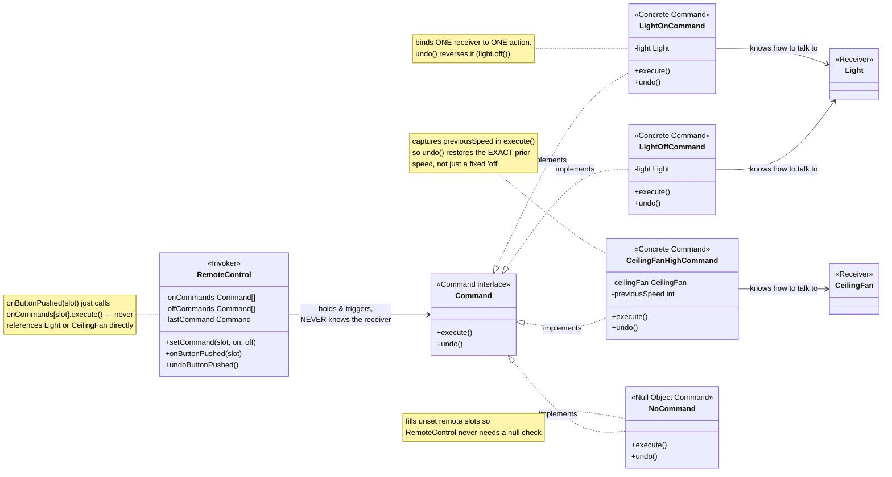
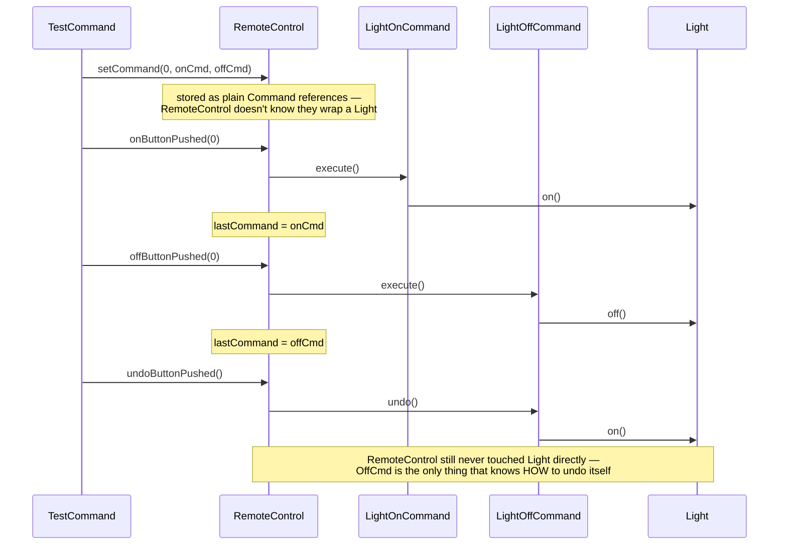

# Command Design Pattern

*Example: the Remote Control, from Head First Design Patterns.*

## What it is
Command encapsulates a request as an object, letting you parameterize clients
with different requests, queue or log them, and support undo — all without
the invoker (the thing triggering the request) knowing anything about the
receiver (the thing that actually does the work).

## Problem it solves
A universal remote has generic "on"/"off" buttons per slot, but each slot can
control a completely different appliance (`Light`, `CeilingFan`, ...) with a
completely different API (`light.on()` vs `ceilingFan.high()`). If
`RemoteControl` had to know about every appliance type directly, adding a new
one would mean editing the remote's code. Command fixes this by wrapping each
button-press action in its own object that knows how to talk to one specific
receiver — the remote just calls `execute()` on whatever's plugged into a slot.

## Participants (mapped to this package)

| Role                | Type      | Class in this package                                              |
|---------------------|-----------|--------------------------------------------------------------------|
| Command              | interface | `Command`                                                           |
| Concrete Command     | class     | `LightOnCommand`, `LightOffCommand`, `CeilingFanHighCommand`, `CeilingFanOffCommand` |
| Null Object Command   | class     | `NoCommand`                                                          |
| Receiver             | class     | `Light`, `CeilingFan`                                                |
| Invoker              | class     | `RemoteControl`                                                      |
| Client               | class     | `TestCommand`                                                        |

- **Command (`Command`)** — declares `execute()` and `undo()`.
- **Concrete Commands** — each binds one receiver to one action:
  `LightOnCommand` wraps a `Light` and calls `light.on()`; `CeilingFanHighCommand`
  wraps a `CeilingFan`, calls `high()`, and remembers the fan's prior speed so
  `undo()` can restore it exactly (not just always turn it off).
- **`NoCommand`** — a null object filling any remote slot that hasn't been
  assigned a real command, so `RemoteControl` never needs a null check.
- **Receivers (`Light`, `CeilingFan`)** — do the actual work; have no idea
  they're being controlled via commands.
- **Invoker (`RemoteControl`)** — holds arrays of on/off `Command`s per slot
  and just calls `execute()`/`undo()` — it never references `Light` or
  `CeilingFan` directly.
- **Client (`TestCommand`)** — wires receivers to commands, loads them into
  the remote, and presses buttons.

## Diagrams

*These two diagrams are meant to be readable on their own — every box is
labeled with its pattern role, and notes spell out what each one actually
does, so you shouldn't need the prose above to follow them.*

### UML class diagram



**How to read this:** `RemoteControl` only ever touches the `Command`
interface — the arrows to `Light`/`CeilingFan` all originate from the
*commands*, never from the remote. That's what lets one invoker (the remote)
control any number of unrelated receiver types without knowing any of their APIs.

### Workflow (sequence diagram)



## Architecture / Flow

```
                    Command (interface)
                    ---------------------------------
                    + execute()
                    + undo()
             ▲            ▲              ▲             ▲
             │            │              │             │
     LightOnCommand LightOffCommand CeilingFanHighCommand CeilingFanOffCommand
     - light           - light          - ceilingFan          - ceilingFan
     execute()->light.on()   execute()->light.off()   execute()->fan.high()   execute()->fan.off()


                    RemoteControl (Invoker)
                    ---------------------------------
                    - onCommands[]  : Command
                    - offCommands[] : Command
                    - lastCommand   : Command
                    + setCommand(slot, on, off)
                    + onButtonPushed(slot)   { onCommands[slot].execute(); }
                    + offButtonPushed(slot)  { offCommands[slot].execute(); }
                    + undoButtonPushed()     { lastCommand.undo(); }
```

### Step-by-step call flow (light on, light off, then undo)

1. `remote.setCommand(0, livingRoomLightOn, livingRoomLightOff)` puts both
   commands into slot 0. `RemoteControl` stores them as plain `Command`
   references — it doesn't know they wrap a `Light`.
2. `remote.onButtonPushed(0)` calls `onCommands[0].execute()`, dispatched to
   `LightOnCommand.execute()`, which calls `light.on()`. `lastCommand` is set
   to this command.
3. `remote.offButtonPushed(0)` calls `offCommands[0].execute()`, dispatched to
   `LightOffCommand.execute()`, which calls `light.off()`. `lastCommand` is
   now the off command.
4. `remote.undoButtonPushed()` calls `lastCommand.undo()` — dispatched to
   `LightOffCommand.undo()`, which calls `light.on()`, reversing the last action.

```
TestCommand --> remote.onButtonPushed(0)
   └──> onCommands[0].execute()   [LightOnCommand.execute()]
            └──> light.on()
   lastCommand = LightOnCommand instance

TestCommand --> remote.offButtonPushed(0)
   └──> offCommands[0].execute()  [LightOffCommand.execute()]
            └──> light.off()
   lastCommand = LightOffCommand instance

TestCommand --> remote.undoButtonPushed()
   └──> lastCommand.undo()        [LightOffCommand.undo()]
            └──> light.on()
```

For the ceiling fan slot, `undo()` isn't simply "the opposite action" — the
fan has three speeds, so `CeilingFanHighCommand`/`CeilingFanOffCommand` each
capture `previousSpeed` in `execute()` and restore that exact speed in
`undo()`, rather than always defaulting to off.

## Why this matters (the point of the pattern)
- `RemoteControl` is completely decoupled from every receiver type — it only
  ever calls `execute()`/`undo()` on the `Command` interface.
- New appliances can be supported by writing new `Command` implementations —
  zero changes to `RemoteControl` (Open/Closed Principle).
- Requests become objects: they can be stored (`lastCommand`), passed around,
  or extended into queues/macros without changing the invoker.
- `NoCommand` removes the need for null checks in the invoker — a design
  pattern (Null Object) working alongside Command here.

## Quick recall checklist
- [ ] Command interface → `execute()` + `undo()` (`Command`)
- [ ] Concrete Command → binds one receiver + one action, captures whatever state undo needs (`LightOnCommand`, `CeilingFanHighCommand`, etc.)
- [ ] Receiver → does the real work, unaware it's wrapped in a command (`Light`, `CeilingFan`)
- [ ] Invoker → holds and triggers commands without knowing their receivers (`RemoteControl`)
- [ ] Null Object → a do-nothing Command filling unset slots, avoiding null checks (`NoCommand`)
