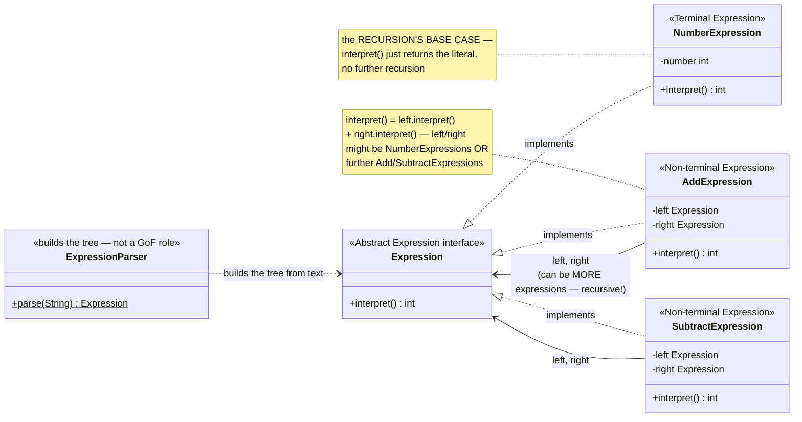
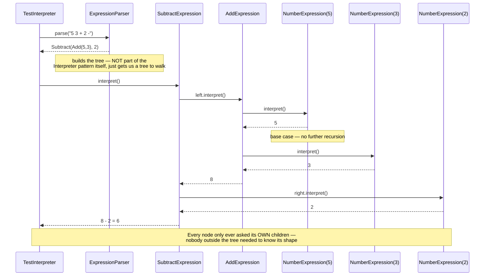

# Interpreter Design Pattern

[← Not sure this is the right pattern? See the decision tree](../../../../PATTERN_DECISION_TREE.md) ·
[quick reference for all 23](../../../../PATTERN_DECISION_TREE.md#user-content-every-pattern-grouped-by-pattern)

*Example: a tiny postfix (RPN) arithmetic evaluator — a Head-First-style
example built for this repo. Head First Design Patterns only covers
Interpreter briefly, in its "leftover patterns" chapter, without a fully
worked example, so this isn't a verbatim book example.*

## What it is
Interpreter defines a representation for a language's grammar, along with an
interpreter that uses that representation to evaluate sentences in the
language. Each grammar rule becomes a class; a sentence in the language
becomes a tree of those classes, and evaluating it means recursively
interpreting the tree from the leaves up.

## Problem it solves
Evaluating an arithmetic expression like `(5 + 3) - 2` means respecting
structure — the `+` has to be resolved before the `-` can use its result.
Hand-rolling this with a pile of string-parsing and conditionals gets messy
fast, especially once expressions can nest arbitrarily deep. Interpreter
solves this by turning the expression into a small tree of objects — one
class per grammar rule (`NumberExpression`, `AddExpression`,
`SubtractExpression`) — where evaluating the whole tree is just each node
asking its children to evaluate themselves first.

## Participants (mapped to this package)

| Role                      | Type      | Class in this package                                |
|---------------------------|-----------|----------------------------------------------------------|
| Abstract Expression         | interface | `Expression`                                                |
| Terminal Expression         | class     | `NumberExpression`                                          |
| Non-terminal Expression     | class     | `AddExpression`, `SubtractExpression`                        |
| (Builder/parser)            | class     | `ExpressionParser` — not a classic Interpreter role, but the code that turns text into a tree |
| Client                      | class     | `TestInterpreter`                                            |

- **Abstract Expression (`Expression`)** — declares `interpret()`, returning
  this node's evaluated value.
- **Terminal Expression (`NumberExpression`)** — the recursion's base case: a
  plain literal, `interpret()` just returns the stored number.
- **Non-terminal Expressions (`AddExpression`, `SubtractExpression`)** — each
  holds two child `Expression`s (which may themselves be numbers or further
  operations) and combines their interpreted values.
- **`ExpressionParser`** — reads a postfix string token by token, using a
  stack to assemble the correct tree shape. This isn't one of the classic
  GoF Interpreter roles, but every real interpreter needs *something* to
  build the tree from input text.
- **Client (`TestInterpreter`)** — parses a few expressions and calls
  `interpret()` on the resulting tree.

## Diagrams

*These two diagrams are meant to be readable on their own — every box is
labeled with its pattern role, and notes spell out what each one actually
does, so you shouldn't need the prose above to follow them.*

### UML class diagram



**How to read this:** `AddExpression`/`SubtractExpression` holding
`Expression` fields (not specifically `NumberExpression`) is what makes the
tree recursive — an operator's operand can be another operator, nested to
any depth. `NumberExpression` is the only class that doesn't recurse; it's
where every chain of `interpret()` calls eventually bottoms out.

### Workflow (sequence diagram — interpreting `"5 3 + 2 -"`)



## Architecture / Flow

```
                    Expression (interface)
                    ---------------------------------
                    + interpret() : int
              ▲              ▲                  ▲
              │              │                  │
     NumberExpression  AddExpression      SubtractExpression
     - number          - left, right       - left, right
     interpret()       interpret() {       interpret() {
        return number      return left.interpret()   return left.interpret()
                                + right.interpret()       - right.interpret()
                          }                           }
```

### Parsing `"5 3 + 2 -"` into a tree

```
token "5"  --> push NumberExpression(5)                    stack: [5]
token "3"  --> push NumberExpression(3)                    stack: [5, 3]
token "+"  --> pop 3, pop 5 --> push AddExpression(5, 3)    stack: [Add(5,3)]
token "2"  --> push NumberExpression(2)                     stack: [Add(5,3), 2]
token "-"  --> pop 2, pop Add(5,3) --> push Subtract(Add(5,3), 2)   stack: [Subtract(Add(5,3), 2)]

Resulting tree:
        SubtractExpression
        /                \
   AddExpression      NumberExpression(2)
   /          \
NumberExpression(5)  NumberExpression(3)
```

### Step-by-step call flow (`interpret()` on that tree)

```
SubtractExpression.interpret()
   ├──> left.interpret()               [AddExpression.interpret()]
   │        ├──> left.interpret()      [NumberExpression(5).interpret() -> 5]
   │        └──> right.interpret()     [NumberExpression(3).interpret() -> 3]
   │        <── returns 5 + 3 = 8
   └──> right.interpret()              [NumberExpression(2).interpret() -> 2]
   <── returns 8 - 2 = 6
```

Every node only ever asks its own children to interpret themselves — nobody
outside the tree needs to know its shape or depth.

## Why this matters (the point of the pattern)
- Each grammar rule is its own small, testable class — no giant
  string-parsing function trying to handle every case at once.
- The tree structure naturally enforces operator precedence/grouping — no
  separate precedence logic is needed once the tree is built correctly.
- New operations (e.g. `MultiplyExpression`) can be added by writing one more
  `Expression` implementation — the existing classes never change.

## Quick recall checklist
- [ ] Abstract Expression → the shared `interpret()` contract (`Expression`)
- [ ] Terminal Expression → the recursion's base case, a literal value (`NumberExpression`)
- [ ] Non-terminal Expression → holds child expressions, combines their interpreted results (`AddExpression`, `SubtractExpression`)
- [ ] Interpreting = recursing → each node interprets its children before combining their results
- [ ] The parser isn't part of the pattern itself → it just builds the tree the pattern then walks
