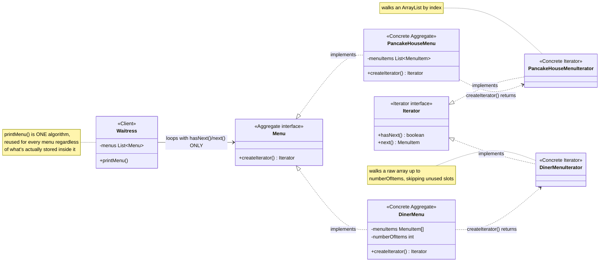
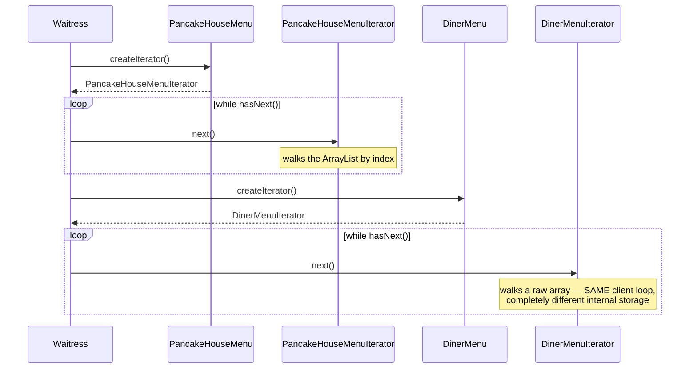

# Iterator Design Pattern

[← Not sure this is the right pattern? See the decision tree](../../../../PATTERN_DECISION_TREE.md)

*Example: the Pancake House / Diner merged menu, from Head First Design Patterns.*

## What it is
Iterator provides a way to access the elements of an aggregate object
sequentially without exposing its underlying representation. Whether a
collection is an array, an `ArrayList`, a tree, or anything else, code that
just wants to walk through its elements shouldn't have to know or care.

## Problem it solves
Two diners merge, but their menus are implemented completely differently:
`PancakeHouseMenu` stores items in an `ArrayList` (breakfast items change
often), `DinerMenu` stores them in a fixed-size array (this menu barely
changes). A single `Waitress` needs to print both menus. Without Iterator,
`printMenu()` would need one code path for `ArrayList.get(i)` and a
completely different one for array indexing with a manual bounds check —
and a third menu with yet another storage type would mean a third code path.
Iterator solves this by having each menu hand out an object that knows how to
walk *that* menu's items, all implementing the same simple interface.

## Participants (mapped to this package)

| Role                | Type      | Class in this package                                     |
|---------------------|-----------|----------------------------------------------------------------|
| Iterator             | interface | `Iterator`                                                      |
| Concrete Iterator    | class     | `PancakeHouseMenu.PancakeHouseMenuIterator`, `DinerMenu.DinerMenuIterator` (private inner classes) |
| Aggregate            | interface | `Menu`                                                          |
| Concrete Aggregate   | class     | `PancakeHouseMenu`, `DinerMenu`                                 |
| Client               | class     | `Waitress` (used by `TestIterator`)                             |

- **Iterator (`Iterator`)** — declares `hasNext()` and `next()`, the minimal
  contract for walking any sequence one element at a time.
- **Concrete Iterators** — each menu defines its own private iterator class
  that knows how to walk *its own* storage: `PancakeHouseMenuIterator` walks
  an `ArrayList` by index; `DinerMenuIterator` walks an array up to
  `numberOfItems`, skipping unused trailing slots.
- **Aggregate (`Menu`)** — declares `createIterator()`, so any menu can be
  asked for an iterator without revealing how it stores its items.
- **Concrete Aggregates (`PancakeHouseMenu`, `DinerMenu`)** — each implements
  `createIterator()` by returning its own private iterator type.
- **Client (`Waitress`)** — holds a list of `Menu`s and prints every item from
  every one, using only `Iterator.hasNext()`/`next()` — it never touches an
  `ArrayList` or an array directly.

## Diagrams

*These two diagrams are meant to be readable on their own — every box is
labeled with its pattern role, and notes spell out what each one actually
does, so you shouldn't need the prose above to follow them.*

### UML class diagram



**How to read this:** `PancakeHouseMenu` and `DinerMenu` store their items in
completely different data structures (`ArrayList` vs. raw array), but
`Waitress` never sees either one — it only calls `hasNext()`/`next()` on
whatever `Iterator` each menu hands back. The two concrete iterators are
where the actual "how do I walk this specific storage" logic lives.

### Workflow (sequence diagram)



## Architecture / Flow

```
                    Menu (Aggregate interface)
                    ---------------------------------
                    + createIterator() : Iterator
                       ▲                      ▲
                       │ implements            │ implements
              PancakeHouseMenu              DinerMenu
              - menuItems: ArrayList<MenuItem>   - menuItems: MenuItem[]


                    Iterator (interface)
                    ---------------------------------
                    + hasNext() : boolean
                    + next()    : MenuItem
                       ▲                                  ▲
                       │ implements                        │ implements
       PancakeHouseMenuIterator                  DinerMenuIterator
       walks the ArrayList by index               walks the array up to numberOfItems
```

### Step-by-step call flow (`Waitress.printMenu()`)

1. `waitress.printMenu()` loops over its list of `Menu`s.
2. For `pancakeHouseMenu`, it calls `menu.createIterator()` — dispatched to
   `PancakeHouseMenu.createIterator()`, which returns a
   `PancakeHouseMenuIterator` wrapping its internal `ArrayList`.
3. `printMenu(iterator)` then calls `hasNext()`/`next()` in a loop — these
   dispatch to the `ArrayList`-walking implementation, but `printMenu()`
   itself has no idea that's what's happening underneath.
4. The exact same `printMenu(iterator)` method is called again for
   `dinerMenu`, this time with a `DinerMenuIterator` wrapping a raw array —
   same loop, same method, completely different internal walk.

```
Waitress.printMenu()
   ├──> pancakeHouseMenu.createIterator()  -> PancakeHouseMenuIterator(ArrayList)
   │        printMenu(iterator)
   │           while (iterator.hasNext())  [walks ArrayList by index]
   │              iterator.next()
   │
   └──> dinerMenu.createIterator()         -> DinerMenuIterator(array, count)
            printMenu(iterator)
               while (iterator.hasNext())  [walks array up to numberOfItems]
                  iterator.next()
```

## Why this matters (the point of the pattern)
- `Waitress` contains exactly one printing algorithm, reused across any
  number of menus, regardless of their internal storage.
- Each aggregate is free to change its internal representation (array,
  `ArrayList`, tree, ...) without breaking any client that only depends on
  `Iterator`.
- A third menu type could be added by writing one more `Menu` + `Iterator`
  pair — `Waitress` never changes.

## Quick recall checklist
- [ ] Iterator interface → `hasNext()` / `next()`, the walk-one-at-a-time contract (`Iterator`)
- [ ] Concrete Iterator → knows how to walk ONE aggregate's specific internal storage (`PancakeHouseMenuIterator`, `DinerMenuIterator`)
- [ ] Aggregate → hands out an iterator instead of exposing its storage (`Menu`, `PancakeHouseMenu`, `DinerMenu`)
- [ ] Client → loops with `hasNext()`/`next()` only, never touches the aggregate's internals (`Waitress`)
