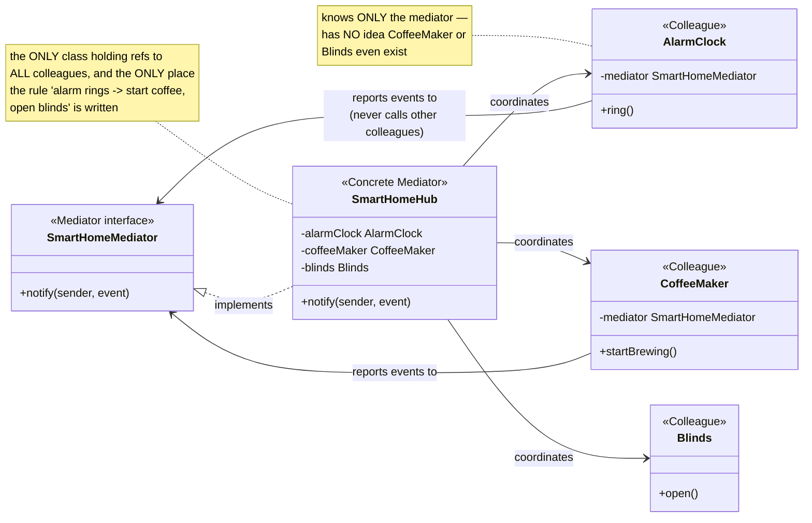
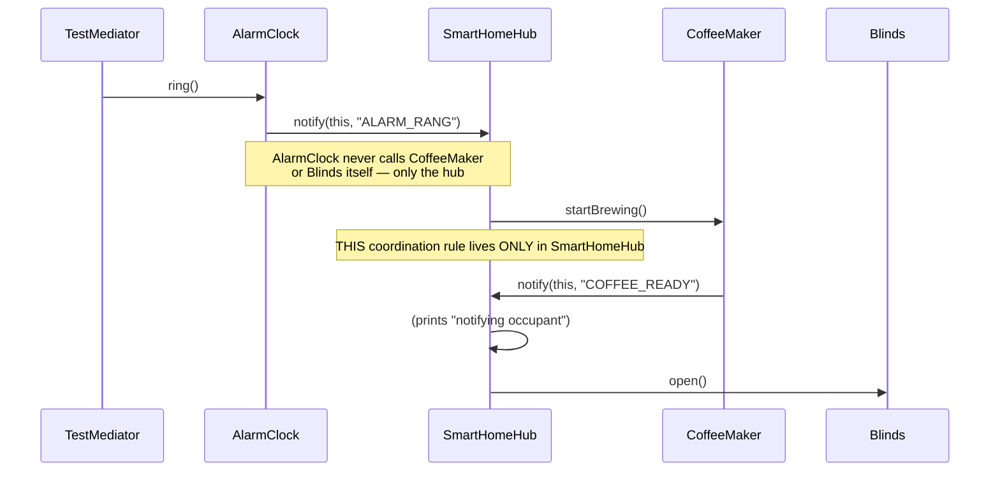

# Mediator Design Pattern

[← Not sure this is the right pattern? See the decision tree](../../../../PATTERN_DECISION_TREE.md) ·
[quick reference for all 23](../../../../PATTERN_DECISION_TREE.md#every-pattern-grouped-by-pattern)

*Example: a smart home hub coordinating an alarm clock, coffee maker, and
blinds — a Head-First-style example built for this repo. Head First Design
Patterns only covers Mediator briefly, in its "leftover patterns" chapter,
without a fully worked example, so this isn't a verbatim book example.*

## What it is
Mediator defines an object that encapsulates how a set of objects interact.
It promotes loose coupling by keeping objects from referring to each other
explicitly, letting you vary their interaction independently.

## Problem it solves
When the alarm rings, the coffee maker should start and the blinds should
open. If `AlarmClock` held direct references to `CoffeeMaker` and `Blinds`
and called their methods itself, every device would need to know about every
other device it might need to trigger — and that web of direct references
gets tangled fast as more devices are added. Mediator fixes this by having
every device report events to one central hub instead, and the hub (not the
devices) decides what should happen in response.

## Participants (mapped to this package)

| Role                | Type      | Class in this package                     |
|---------------------|-----------|-----------------------------------------------|
| Mediator             | interface | `SmartHomeMediator`                             |
| Concrete Mediator     | class     | `SmartHomeHub`                                  |
| Colleague             | class     | `AlarmClock`, `CoffeeMaker`, `Blinds`            |
| Client                | class     | `TestMediator`                                  |

- **Mediator (`SmartHomeMediator`)** — declares `notify(sender, event)`, the
  one method every colleague uses to report something happened.
- **Concrete Mediator (`SmartHomeHub`)** — the only class that holds
  references to every colleague, and the only place the coordination rule
  ("alarm rings → start coffee, open blinds") is written down.
- **Colleagues (`AlarmClock`, `CoffeeMaker`, `Blinds`)** — each only knows
  about the mediator (or, in `Blinds`'s case, nothing at all — it's a
  pure reactor). None of them holds a reference to any other colleague.
- **Client (`TestMediator`)** — wires all colleagues to the same hub, then
  triggers one event (`alarmClock.ring()`) and lets the hub's rules cascade
  from there.

## Diagrams

*These two diagrams are meant to be readable on their own — every box is
labeled with its pattern role, and notes spell out what each one actually
does, so you shouldn't need the prose above to follow them.*

### UML class diagram



**How to read this:** notice there are no arrows directly between
`AlarmClock`, `CoffeeMaker`, and `Blinds` — every colleague-to-colleague
interaction is forced through `SmartHomeHub`. That's the entire pattern: the
web of "who calls whom" collapses into one central class instead of being
spread across every participant.

### Workflow (sequence diagram)



## Architecture / Flow

```
        AlarmClock         CoffeeMaker          Blinds
        ----------         -----------          ------
        - mediator         - mediator           (no mediator reference —
        + ring() {           + startBrewing() {    only ever acted upon)
            mediator.notify(   mediator.notify(
              this,             this,
              "ALARM_RANG")     "COFFEE_READY")
          }                   }
             │                    │                   ▲
             │  notify(sender,event)                   │ open()
             ▼                    ▼                   │
                    SmartHomeMediator (interface)
                    ---------------------------------
                    + notify(sender, event)
                              ▲
                              │ implements
                        SmartHomeHub (Concrete Mediator)
                    - alarmClock, coffeeMaker, blinds
                    notify(sender, event) {
                        if sender==alarmClock && event=="ALARM_RANG":
                            coffeeMaker.startBrewing()
                            blinds.open()
                        if sender==coffeeMaker && event=="COFFEE_READY":
                            ...
                    }
```

### Step-by-step call flow (`alarmClock.ring()`)

1. `alarmClock.ring()` prints its own message, then calls
   `mediator.notify(this, "ALARM_RANG")` — `AlarmClock` never calls
   `coffeeMaker` or `blinds` itself.
2. `SmartHomeHub.notify(sender, event)` checks: is `sender` the alarm clock
   and `event` `"ALARM_RANG"`? Yes — so it calls `coffeeMaker.startBrewing()`
   and `blinds.open()` directly. This coordination logic lives *only* here.
3. `coffeeMaker.startBrewing()` itself also reports back:
   `mediator.notify(this, "COFFEE_READY")` — which the hub handles with its
   own separate rule.

```
TestMediator --> alarmClock.ring()
AlarmClock.ring()
   └──> mediator.notify(alarmClock, "ALARM_RANG")
SmartHomeHub.notify(alarmClock, "ALARM_RANG")
   ├──> coffeeMaker.startBrewing()
   │        CoffeeMaker.startBrewing()
   │           └──> mediator.notify(coffeeMaker, "COFFEE_READY")
   │                    SmartHomeHub.notify(coffeeMaker, "COFFEE_READY")
   │                       └──> prints "notifying occupant"
   └──> blinds.open()
```

## Why this matters (the point of the pattern)
- No colleague holds a reference to any other colleague — `AlarmClock`
  doesn't know `CoffeeMaker` or `Blinds` even exist.
- All the interaction rules live in one place (`SmartHomeHub`), so adding a
  new rule ("also turn on the kitchen lights") means editing the hub only,
  not every colleague that might be involved.
- Colleagues can be tested or reused independently, since they only depend on
  the small `SmartHomeMediator` interface, not on each other.

## Quick recall checklist
- [ ] Mediator interface → the one channel every colleague reports through (`SmartHomeMediator`)
- [ ] Concrete Mediator → holds every colleague reference and all the coordination rules (`SmartHomeHub`)
- [ ] Colleague → knows only the mediator, never another colleague directly (`AlarmClock`, `CoffeeMaker`, `Blinds`)
- [ ] Client → wires colleagues to one mediator, then just triggers events — the mediator handles the fan-out
