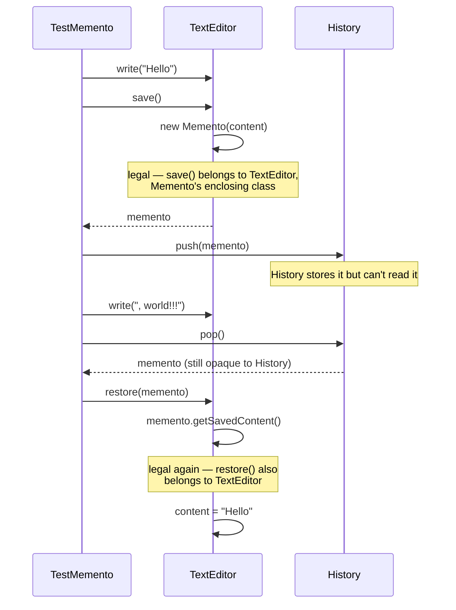

# Memento Design Pattern

[← Not sure this is the right pattern? See the decision tree](../../../../PATTERN_DECISION_TREE.md)

*Example: undo in a text editor — a Head-First-style example built for this
repo. Head First Design Patterns only covers Memento briefly, in its
"leftover patterns" chapter, without a fully worked example, so this isn't a
verbatim book example.*

## What it is
Memento captures and externalizes an object's internal state so it can be
restored later, without violating encapsulation — the object doing the
saving/loading is the only one that ever sees what's actually inside the snapshot.

## Problem it solves
Undo in a text editor means being able to go back to an earlier version of
its content. A naive approach might expose a `getInternalContent()` getter so
some outside `History` class can grab and store it directly — but that leaks
the editor's internals to code that has no business touching them, and
nothing stops that external code from mutating the saved copy. Memento fixes
this: the editor hands out an opaque snapshot object that only the editor
itself can create or read the contents of; the caretaker (`History`) can
store and hand these back, but never open them.

## Participants (mapped to this package)

| Role                | Type       | Class in this package                              |
|---------------------|------------|---------------------------------------------------------|
| Originator            | class      | `TextEditor`                                              |
| Memento               | nested class | `TextEditor.Memento`                                     |
| Caretaker             | class      | `History`                                                 |
| Client                | class      | `TestMemento`                                             |

- **Originator (`TextEditor`)** — the object whose state gets saved/restored.
  `save()` returns a new `Memento`; `restore(memento)` pulls the content back
  out of one.
- **Memento (`TextEditor.Memento`)** — a `private static` nested class with a
  `private` constructor and a `private` getter. Because it's nested inside
  `TextEditor`, only `TextEditor`'s own code can construct one or read
  `getSavedContent()` — `History` can hold the reference, but Java's access
  rules stop it from ever looking inside.
- **Caretaker (`History`)** — stores mementos (as a stack, here) and hands
  them back on request via `push()`/`pop()`. It never inspects what's inside one.
- **Client (`TestMemento`)** — drives the editor, checkpoints it into
  `history` at chosen points, and restores earlier checkpoints to undo.

## Diagrams

*These two diagrams are meant to be readable on their own — every box is
labeled with its pattern role, and notes spell out what each one actually
does, so you shouldn't need the prose above to follow them.*

### UML class diagram

```mermaid
classDiagram
    direction LR

    class TextEditor {
        <<Originator>>
        -content String
        +write(text)
        +save() Memento
        +restore(Memento)
    }
    class Memento {
        <<Memento — private nested class>>
        -content String
        -Memento(String)
        -getSavedContent() String
    }
    class History {
        <<Caretaker>>
        -checkpoints Deque~Memento~
        +push(Memento)
        +pop() Memento
    }

    TextEditor +-- Memento : nested inside TextEditor
    TextEditor ..> Memento : ONLY class that can<br/>construct or read one
    History o-- Memento : stores/hands back,<br/>can NEVER see inside one

    note for Memento "constructor AND getter are private.<br/>Only TextEditor (its enclosing class)<br/>can ever call them — Java's own access<br/>rules enforce the encapsulation"
    note for History "holds Mementos as opaque objects.<br/>push()/pop() never touch content —<br/>they literally cannot, it's private"
```

**How to read this:** the note on `Memento` is the entire pattern —
`private` members on a class *nested inside* the Originator means only the
Originator's own methods (`save()`, `restore()`) can ever reach inside one.
`History` can shuttle `Memento` objects around all day without the language
even allowing it to peek at what's inside.

### Workflow (sequence diagram)



## Architecture / Flow

```
                    TextEditor (Originator)
                    ---------------------------------
                    - content : String
                    + write(text)
                    + save()    : Memento   { return new Memento(content); }
                    + restore(Memento m)     { content = m.getSavedContent(); }

                    TextEditor.Memento (nested, private members)
                    ---------------------------------
                    - content : String            <-- only TextEditor can read this
                    - Memento(String)              <-- only TextEditor can construct this


                    History (Caretaker)
                    ---------------------------------
                    - checkpoints : Deque<TextEditor.Memento>
                    + push(Memento)
                    + pop() : Memento
                    (holds Mementos opaquely — cannot call their private members)
```

### Step-by-step call flow

1. `editor.write("Hello")` then `history.push(editor.save())`.
   `editor.save()` runs `new Memento(content)` — legal, because `save()` is a
   method of `TextEditor`, the memento's enclosing class. The resulting
   `Memento` is pushed into `history`, which only ever treats it as an opaque object.
2. More writes and another checkpoint follow the same way.
3. `editor.write("!!!")` continues typing without checkpointing.
4. `editor.restore(history.pop())` — `history.pop()` hands back the most
   recent `Memento` (still opaque to `History`). `restore()` runs
   `memento.getSavedContent()` — legal again, because `restore()` is also a
   method of `TextEditor`.

```
editor.write("Hello")
history.push(editor.save())          [TextEditor.save() -> new Memento("Hello")]

editor.write(", world")
history.push(editor.save())          [TextEditor.save() -> new Memento("Hello, world")]

editor.write("!!!")                  [content is now "Hello, world!!!", no checkpoint]

editor.restore(history.pop())
   history.pop() --> Memento("Hello, world")     [History never reads inside it]
   TextEditor.restore(memento)
      └──> memento.getSavedContent()             [legal — TextEditor is the enclosing class]
      └──> content = "Hello, world"
```

## Why this matters (the point of the pattern)
- The editor's internal representation stays fully encapsulated — `History`
  can store and retrieve snapshots without ever being able to read or mutate
  what's inside one.
- Undo/redo logic (`History`) is decoupled from the object being
  snapshotted (`TextEditor`) — the same `History` class could checkpoint any
  originator that exposes `save()`/`restore()`.
- If `TextEditor`'s internal state grows (say, cursor position, selection),
  only `TextEditor.Memento` needs to change — `History` doesn't care what's inside.

## Quick recall checklist
- [ ] Originator → the object being snapshotted; the only one that can create/read its own Mementos (`TextEditor`)
- [ ] Memento → an opaque snapshot, nested + `private` members so only the Originator can see inside it (`TextEditor.Memento`)
- [ ] Caretaker → stores/hands back Mementos, never inspects them (`History`)
- [ ] Encapsulation is the whole point → if the caretaker could read a memento's contents, the pattern's guarantee is broken
