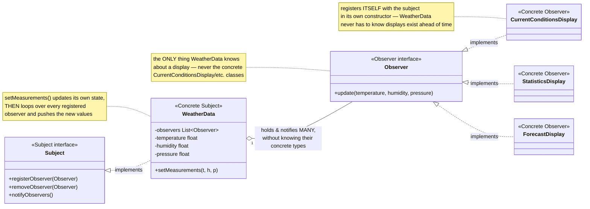
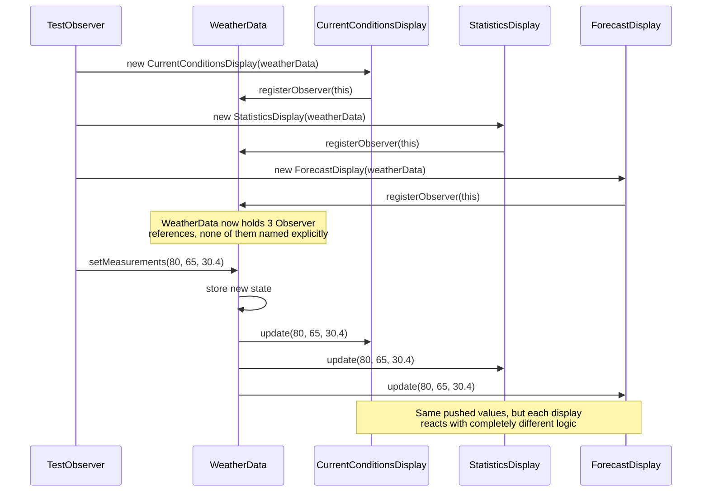

# Observer Design Pattern

*Example: the Weather Station, from Head First Design Patterns.*

## What it is
Observer defines a one-to-many dependency between objects so that when one
object (the Subject) changes state, all its dependents (Observers) are
notified and updated automatically — without the Subject needing to know
anything concrete about them.

## Problem it solves
A weather station has multiple displays (current conditions, statistics,
forecast) that all need to react whenever new sensor data comes in. If
`WeatherData` called each display directly (`currentDisplay.update(...)`,
`statisticsDisplay.update(...)`, ...), adding a new display would mean
editing `WeatherData` every time. Observer inverts that: displays register
themselves with the subject, and the subject just loops over whoever's
registered — new displays can be added with zero changes to `WeatherData`.

## Participants (mapped to this package)

| Role                | Type      | Class in this package                                         |
|---------------------|-----------|--------------------------------------------------------------------|
| Subject              | interface | `Subject`                                                          |
| Concrete Subject     | class     | `WeatherData`                                                      |
| Observer             | interface | `Observer`                                                         |
| Concrete Observer    | class     | `CurrentConditionsDisplay`, `StatisticsDisplay`, `ForecastDisplay` |
| Client               | class     | `TestObserver`                                                     |

- **Subject (`Subject`)** — declares `registerObserver`, `removeObserver`,
  `notifyObservers`. Any object with observers to manage implements this.
- **Concrete Subject (`WeatherData`)** — holds the actual measurements and the
  list of registered observers; `setMeasurements(...)` updates state then
  calls `notifyObservers()`.
- **Observer (`Observer`)** — declares `update(temperature, humidity, pressure)`,
  the callback every display must implement.
- **Concrete Observers (`CurrentConditionsDisplay`, `StatisticsDisplay`,
  `ForecastDisplay`)** — each registers itself with a `Subject` in its own
  constructor, then reacts differently to the same pushed data (current
  snapshot vs. running min/max/avg vs. pressure-trend forecast).
- **Client (`TestObserver`)** — wires up the displays against one
  `WeatherData` and feeds in new readings.

## Diagrams

*These two diagrams are meant to be readable on their own — every box is
labeled with its pattern role, and notes spell out what each one actually
does, so you shouldn't need the prose above to follow them.*

### UML class diagram



**How to read this:** `WeatherData` holds a list typed as `Observer` — plural,
unbounded, and abstract. It never names `CurrentConditionsDisplay`,
`StatisticsDisplay`, or `ForecastDisplay` anywhere in its own code; each of
those registers itself. Adding a fourth display later means writing one more
`Observer` implementation and nothing else.

### Workflow (sequence diagram)



## Architecture / Flow

```
                    Subject (interface)
                    ---------------------------------
                    + registerObserver(Observer)
                    + removeObserver(Observer)
                    + notifyObservers()
                            ▲
                            │ implements
                       WeatherData
                    ---------------------------------
                    - observers : List<Observer>
                    - temperature, humidity, pressure
                    + setMeasurements(...)  --> notifyObservers()


                    Observer (interface)
                    ---------------------------------
                    + update(temperature, humidity, pressure)
                       ▲              ▲               ▲
                       │              │               │
        CurrentConditionsDisplay StatisticsDisplay ForecastDisplay
```

### Step-by-step call flow

1. `new CurrentConditionsDisplay(weatherData)` (and the other two displays)
   each call `weatherData.registerObserver(this)` in their own constructor —
   `WeatherData` now holds a list of three `Observer` references, without
   knowing their concrete types.
2. `weatherData.setMeasurements(80, 65, 30.4f)` updates the subject's own
   fields, then calls `measurementsChanged()` → `notifyObservers()`.
3. `notifyObservers()` loops over every registered observer and calls
   `observer.update(temperature, humidity, pressure)` on each.
4. Each concrete observer's `update()` runs its own logic on the exact same
   pushed values — `CurrentConditionsDisplay` just stores and re-displays them;
   `StatisticsDisplay` folds the temperature into a running min/max/average;
   `ForecastDisplay` compares the new pressure against the last one.

```
TestObserver --> weatherData.setMeasurements(80, 65, 30.4f)
WeatherData.setMeasurements(...)
   ├──> stores temperature/humidity/pressure
   └──> notifyObservers()
            ├──> currentDisplay.update(80, 65, 30.4)   -> prints current conditions
            ├──> statisticsDisplay.update(80, 65, 30.4) -> folds into running stats, prints them
            └──> forecastDisplay.update(80, 65, 30.4)   -> compares pressure, prints forecast
```

## Why this matters (the point of the pattern)
- `WeatherData` never names `CurrentConditionsDisplay`, `StatisticsDisplay`,
  or `ForecastDisplay` — it only depends on the `Observer` abstraction.
- New displays can be added by writing one more `Observer` implementation and
  registering it — zero changes to `WeatherData` (Open/Closed Principle).
- Observers can also unregister at runtime (`removeObserver`), so the set of
  interested parties isn't fixed at compile time.

## Quick recall checklist
- [ ] Subject → manages a list of observers, notifies them on state change (`Subject`, `WeatherData`)
- [ ] Observer → the callback contract every dependent implements (`Observer`)
- [ ] Concrete Observer → registers itself with a subject, reacts to pushed data (`CurrentConditionsDisplay`, etc.)
- [ ] Push model → the subject sends the new state directly in `update(...)`, observers don't have to pull it themselves
- [ ] Client → wires observers to a subject; the subject stays decoupled from their concrete types
