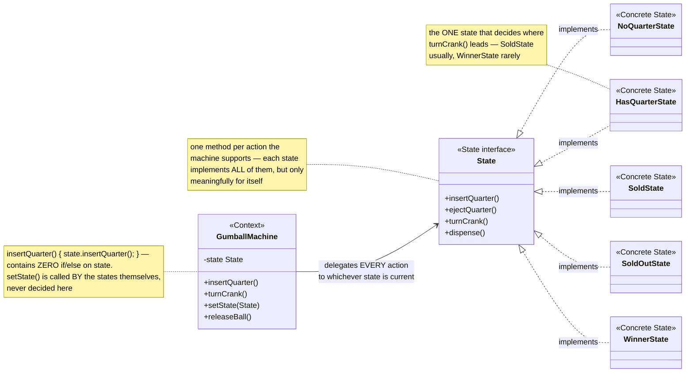
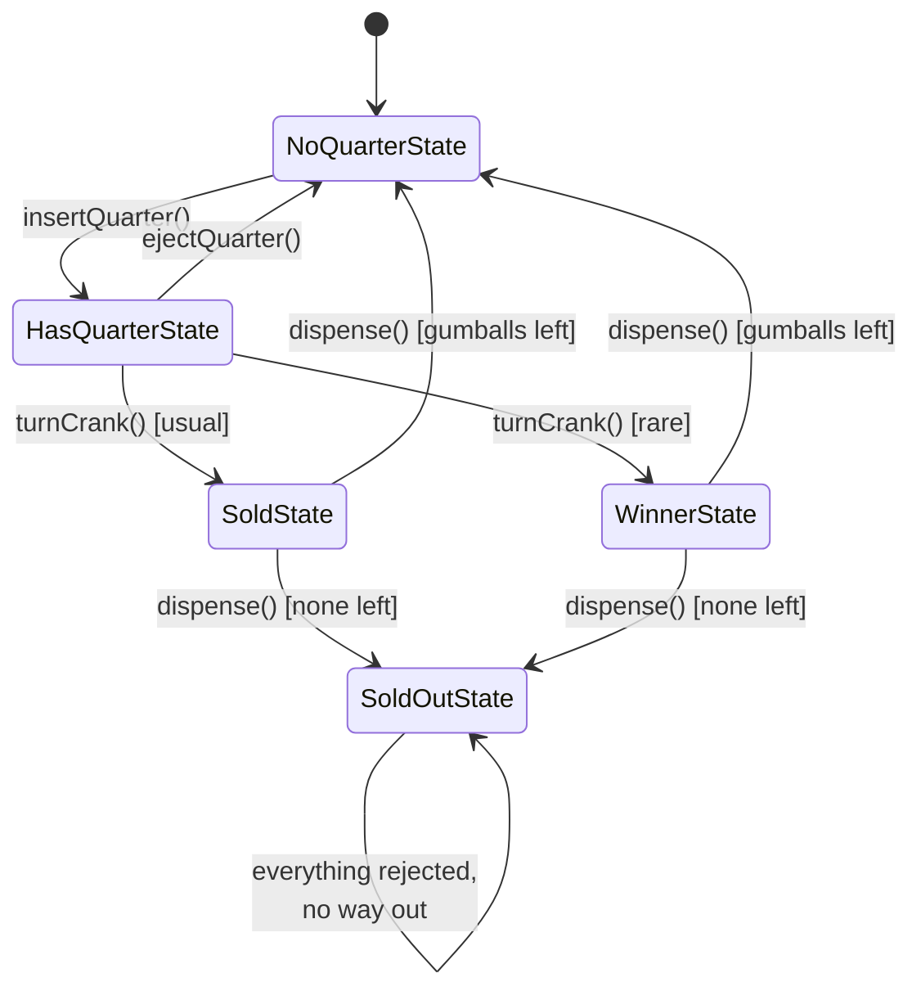
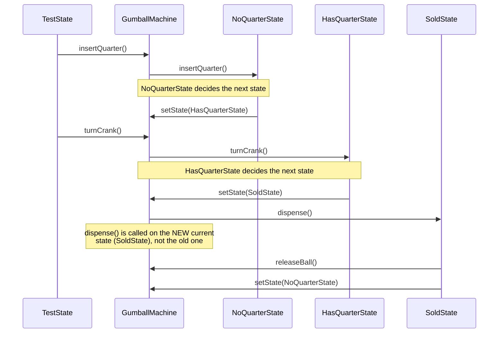

# State Design Pattern

*Example: the Gumball Machine, from Head First Design Patterns.*

## What it is
State allows an object to alter its behavior when its internal state changes
— the object will appear to change its class. Instead of one big method full
of `if (state == SOLD)` / `if (state == NO_QUARTER)` conditionals, each state
becomes its own class implementing the same interface, and the context just
delegates to whichever one is currently active.

## Problem it solves
A gumball machine behaves completely differently depending on whether a
quarter's been inserted, whether it's sold out, or whether the crank was just
turned. Handling this with `int state` and giant `if`/`switch` blocks in every
method gets unmanageable fast, and adding a new state (like the "winner" jackpot)
means touching every one of those conditionals. State fixes this by giving
each state its own class that implements the shared behavior for *that* state
only — the machine just asks its current state object what to do.

## Participants (mapped to this package)

| Role                | Type      | Class in this package                                                        |
|---------------------|-----------|-------------------------------------------------------------------------------|
| State                | interface | `State`                                                                        |
| Concrete State       | class     | `NoQuarterState`, `HasQuarterState`, `SoldState`, `SoldOutState`, `WinnerState` |
| Context              | class     | `GumballMachine`                                                               |
| Client               | class     | `TestState`                                                                    |

- **State (`State`)** — declares one method per action the machine supports:
  `insertQuarter()`, `ejectQuarter()`, `turnCrank()`, `dispense()`.
- **Concrete States** — each implements all four methods, but only in ways
  that make sense for that state (e.g. `NoQuarterState.turnCrank()` just
  complains; `HasQuarterState.turnCrank()` actually transitions the machine).
  Each state is also the one place that decides which state comes next.
- **Context (`GumballMachine`)** — holds a reference to the current `State`
  and delegates every public method to it (`state.insertQuarter()`, etc.). It
  also holds one singleton instance of each concrete state so they can be
  swapped in via `setState(...)` without re-allocating.
- **Client (`TestState`)** — calls the machine's public methods; the machine's
  actual behavior differs run to run purely based on which state it's
  currently in — no conditionals in `TestState` either.

## Diagrams

*These three diagrams are meant to be readable on their own — every box is
labeled with its pattern role, and notes spell out what each one actually
does, so you shouldn't need the prose above to follow them.*

### UML class diagram



**How to read this:** `GumballMachine` has exactly one field of type `State`
and delegates every public method straight to it — there's no conditional
logic in the context at all. Each state class both implements the shared
behavior contract *and* decides which state comes next, which is why the
transition logic lives in the diagram below instead of in `GumballMachine`.

### State transitions



**How to read this:** every arrow here is triggered by one state calling
`machine.setState(...)` on itself — this whole graph is scattered across the
five state classes, not centralized in `GumballMachine`. `SoldOutState` is a
dead end by design: once the machine is empty, nothing transitions it back out.

### Workflow (sequence diagram)



## Architecture / Flow

```
                    State (interface)
                    ---------------------------------
                    + insertQuarter()
                    + ejectQuarter()
                    + turnCrank()
                    + dispense()
          ▲            ▲            ▲            ▲            ▲
          │            │            │            │            │
   NoQuarterState HasQuarterState SoldState SoldOutState WinnerState


                    GumballMachine (Context)
                    ---------------------------------
                    - state : State
                    + insertQuarter() { state.insertQuarter(); }
                    + turnCrank()     { state.turnCrank(); state.dispense(); }
                    + setState(State) <-- called BY the states themselves
```

### State transition diagram

```
   NoQuarterState --insertQuarter()--> HasQuarterState
   HasQuarterState --ejectQuarter()--> NoQuarterState
   HasQuarterState --turnCrank()--> SoldState (usually) or WinnerState (rare)
   SoldState --dispense()--> NoQuarterState (gumballs left) or SoldOutState (none left)
   WinnerState --dispense()--> NoQuarterState (gumballs left) or SoldOutState (none left)
   SoldOutState --(everything rejected, no transitions out)
```

### Step-by-step call flow (insert quarter, then turn crank)

1. `machine.insertQuarter()` delegates to `state.insertQuarter()`. The
   machine starts in `NoQuarterState`, so `NoQuarterState.insertQuarter()`
   runs: prints a message and calls `machine.setState(machine.getHasQuarterState())`.
2. `machine.turnCrank()` calls `state.turnCrank()` then `state.dispense()`.
   `state` is now `HasQuarterState`, so `HasQuarterState.turnCrank()` runs —
   it rolls the "winner" chance and calls `machine.setState(...)`, switching
   to `SoldState` (usually).
3. `state.dispense()` is then called on whatever the *new* current state is
   — `SoldState.dispense()` — which calls `machine.releaseBall()` and
   transitions back to `NoQuarterState` (or `SoldOutState` if that was the last one).

```
TestState --> machine.insertQuarter()
GumballMachine.insertQuarter()
   └──> state.insertQuarter()             [dispatched to NoQuarterState]
            └──> machine.setState(HasQuarterState)

TestState --> machine.turnCrank()
GumballMachine.turnCrank()
   ├──> state.turnCrank()                 [dispatched to HasQuarterState]
   │        └──> machine.setState(SoldState)   [or WinnerState, rare]
   └──> state.dispense()                  [dispatched to the NEW current state: SoldState]
            └──> machine.releaseBall()
            └──> machine.setState(NoQuarterState or SoldOutState)
```

Notice `GumballMachine` never contains a single `if (state == ...)` check —
every branch of logic lives inside the state classes themselves.

## Why this matters (the point of the pattern)
- All the state-specific behavior and transition logic for one state lives in
  one class — no giant conditional block scattered across every method.
- Adding a new state (the pattern already includes `WinnerState` as an
  example) means writing one new class — `GumballMachine` never changes.
- The context's code (`insertQuarter()`, `turnCrank()`, ...) stays simple:
  just delegate to `state`.
- States decide their own transitions, keeping that logic co-located with the
  behavior it depends on, instead of centralized in the context.

## Quick recall checklist
- [ ] State interface → one method per context action (`State`)
- [ ] Concrete State → implements those methods only as valid for that state, decides the next state (`NoQuarterState`, `HasQuarterState`, etc.)
- [ ] Context → holds current state, delegates every action to it (`GumballMachine`)
- [ ] Transitions → triggered by the state itself calling `context.setState(...)`, not by the context
- [ ] No conditionals in the context → if you see `if (state == X)` in the context, State hasn't been applied yet
