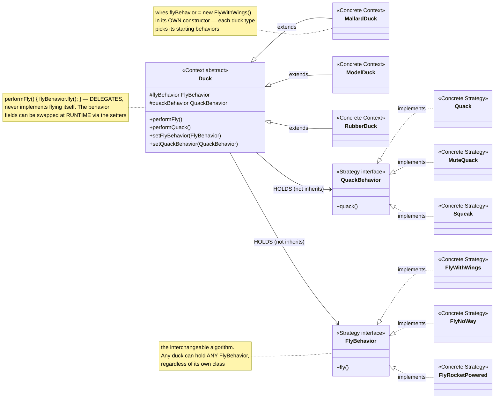
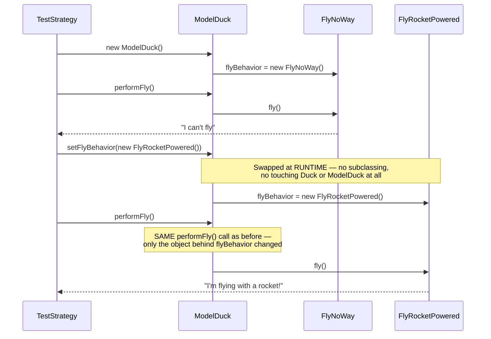

# Strategy Design Pattern

[← Not sure this is the right pattern? See the decision tree](../../../../PATTERN_DECISION_TREE.md)

*Example: the Duck Simulator (SimUDuck), from Head First Design Patterns — its opening, defining example.*

## What it is
Strategy defines a family of algorithms, encapsulates each one, and makes
them interchangeable. The algorithm can vary independently from the code
that uses it — a `Duck` *has a* `FlyBehavior` instead of *being* a class that
implements flying itself.

## Problem it solves
A `Duck` superclass with a default `fly()` method breaks the moment you add a
`RubberDuck` (can't fly) or a `DecoyDuck` (also can't fly) — each has to
override `fly()` to do nothing, and if you ever need to change flying
behavior for a group of ducks, you're stuck editing every subclass
individually or fighting a fragile inheritance hierarchy. Strategy pulls
"flying" (and "quacking") out into their own interchangeable objects, so
ducks compose the behaviors they need instead of inheriting fixed ones.

## Participants (mapped to this package)

| Role                | Type      | Class in this package                                    |
|---------------------|-----------|--------------------------------------------------------------|
| Context              | abstract class | `Duck`                                                  |
| Concrete Context      | class     | `MallardDuck`, `ModelDuck`, `RubberDuck`                     |
| Strategy (flying)     | interface | `FlyBehavior`                                               |
| Concrete Strategy     | class     | `FlyWithWings`, `FlyNoWay`, `FlyRocketPowered`               |
| Strategy (quacking)   | interface | `QuackBehavior`                                              |
| Concrete Strategy     | class     | `Quack`, `MuteQuack`, `Squeak`                               |
| Client                | class     | `TestStrategy`                                               |

- **Context (`Duck`)** — holds a `FlyBehavior` and a `QuackBehavior` and
  delegates to them (`performFly()`, `performQuack()`) instead of
  implementing flying/quacking itself.
- **Concrete Contexts (`MallardDuck`, `ModelDuck`, `RubberDuck`)** — each wires
  up whichever behavior objects fit it in their constructor.
- **Strategies (`FlyBehavior`, `QuackBehavior`)** — the interchangeable
  algorithm families.
- **Concrete Strategies (`FlyWithWings`/`FlyNoWay`/`FlyRocketPowered`,
  `Quack`/`MuteQuack`/`Squeak`)** — the actual algorithm implementations.
- **Client (`TestStrategy`)** — creates ducks and can swap a duck's strategy
  at runtime via `setFlyBehavior(...)`.

## Diagrams

*These two diagrams are meant to be readable on their own — every box is
labeled with its pattern role, and notes spell out what each one actually
does, so you shouldn't need the prose above to follow them.*

### UML class diagram



**How to read this:** the arrows from `Duck` to `FlyBehavior`/`QuackBehavior`
are composition ("has-a"), not inheritance — that's the entire point of
Strategy. A duck's flying behavior is an *object it holds*, swappable at
runtime, completely separate from the duck's own class hierarchy on the left.

### Workflow (sequence diagram — swapping a strategy at runtime)



## Architecture / Flow

```
                    Duck (Context, abstract)
                    ----------------------------------
                    - flyBehavior   : FlyBehavior
                    - quackBehavior : QuackBehavior
                    + performFly()    { flyBehavior.fly(); }
                    + performQuack()  { quackBehavior.quack(); }
                    + setFlyBehavior(FlyBehavior)
                    + setQuackBehavior(QuackBehavior)
                       ▲            ▲            ▲
                       │            │            │
                MallardDuck    ModelDuck     RubberDuck


      FlyBehavior (Strategy)                QuackBehavior (Strategy)
      ------------------------              ------------------------
      + fly()                                + quack()
        ▲        ▲        ▲                    ▲        ▲        ▲
        │        │        │                    │        │        │
  FlyWithWings FlyNoWay FlyRocketPowered      Quack   MuteQuack  Squeak
```

### Step-by-step call flow (swapping `ModelDuck`'s flying strategy)

1. `new ModelDuck()` wires `flyBehavior = new FlyNoWay();` in its constructor.
2. `model.performFly()` delegates: `flyBehavior.fly()` → dispatched to
   `FlyNoWay.fly()` → prints `"I can't fly"`.
3. `model.setFlyBehavior(new FlyRocketPowered());` swaps the strategy object
   held by `model` — no subclassing, no touching `Duck` or `ModelDuck` at all.
4. `model.performFly()` again — same code path, but now `flyBehavior` points
   at the new `FlyRocketPowered`, so it prints `"I'm flying with a rocket!"`.

```
new ModelDuck()
   └──> flyBehavior = new FlyNoWay()

model.performFly()
   └──> flyBehavior.fly()   [dispatched to FlyNoWay.fly()]  -> "I can't fly"

model.setFlyBehavior(new FlyRocketPowered())
   └──> flyBehavior = new FlyRocketPowered()   [swapped at runtime]

model.performFly()
   └──> flyBehavior.fly()   [dispatched to FlyRocketPowered.fly()]  -> "I'm flying with a rocket!"
```

## Why this matters (the point of the pattern)
- **Composition over inheritance** — behaviors are objects a `Duck` *has*,
  not methods it inherits, so behavior changes don't ripple through a class
  hierarchy.
- Behaviors can be **swapped at runtime** (`setFlyBehavior`), which a fixed
  inherited method can never do.
- New behaviors (`FlyRocketPowered`) can be added without touching `Duck` or
  any existing duck subclass — Open/Closed Principle.
- The same `FlyBehavior`/`QuackBehavior` objects can be shared and reused
  across many different duck instances.

## Quick recall checklist
- [ ] Context → holds a reference to a Strategy instead of implementing the behavior itself (`Duck`)
- [ ] Strategy interface → the interchangeable algorithm's contract (`FlyBehavior`, `QuackBehavior`)
- [ ] Concrete Strategy → one specific algorithm implementation (`FlyWithWings`, `Quack`, etc.)
- [ ] Context delegates, never implements → `performFly()` just calls `flyBehavior.fly()`
- [ ] Strategies are swappable at runtime → `setFlyBehavior(...)` changes behavior with zero subclassing
