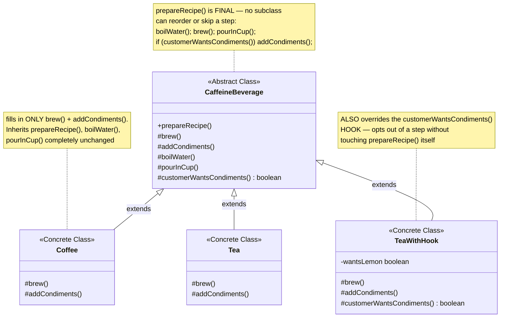
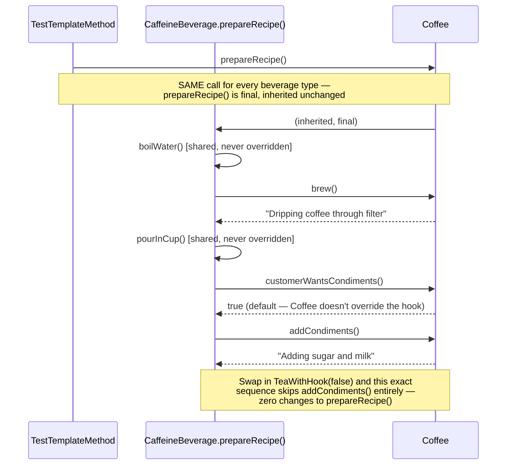

# Template Method Design Pattern

*Example: Caffeine Beverage, from Head First Design Patterns.*

## What it is
Template Method defines the skeleton of an algorithm in a method, deferring
some steps to subclasses. Subclasses can redefine certain steps of the
algorithm without changing its overall structure — the structure itself lives
in one place and is never duplicated.

## Problem it solves
Making coffee and making tea are almost the same process: boil water, brew,
pour into a cup, add a condiment. Only "brew" and "add condiment" actually
differ. Without Template Method, `Coffee.prepareRecipe()` and
`Tea.prepareRecipe()` would each duplicate the boil/pour steps, and any future
beverage would have to copy that duplication too. Template Method puts the
algorithm's fixed shape in one `final` method on the base class, and lets
subclasses fill in only the steps that actually vary.

## Participants (mapped to this package)

| Role                | Type            | Class in this package         |
|---------------------|-----------------|----------------------------------|
| Abstract Class        | abstract class  | `CaffeineBeverage`               |
| Concrete Class        | class           | `Coffee`, `Tea`, `TeaWithHook`   |
| Client                | class           | `TestTemplateMethod`             |

- **Abstract Class (`CaffeineBeverage`)** — defines the `final prepareRecipe()`
  template method that calls, in order: `boilWater()` (concrete, shared),
  `brew()` (abstract), `pourInCup()` (concrete, shared),
  and conditionally `addCondiments()` (abstract) — gated by the
  `customerWantsCondiments()` **hook**.
- **Concrete Classes (`Coffee`, `Tea`)** — implement only `brew()` and
  `addCondiments()`; they inherit `prepareRecipe()`, `boilWater()`, and
  `pourInCup()` completely unchanged.
- **`TeaWithHook`** — additionally overrides the `customerWantsCondiments()`
  hook, showing how a subclass can opt out of an optional step without
  touching the template method itself.
- **Client (`TestTemplateMethod`)** — calls `prepareRecipe()` on each beverage;
  the exact same call produces a different sequence of printed steps
  depending on which concrete class is behind the `CaffeineBeverage` reference.

## Diagrams

*These two diagrams are meant to be readable on their own — every box is
labeled with its pattern role, and notes spell out what each one actually
does, so you shouldn't need the prose above to follow them.*

### UML class diagram



**How to read this:** only `CaffeineBeverage` has `prepareRecipe()`, and it's
`final` — none of the three subclasses below it can override it. Each
subclass only fills in the two steps that genuinely differ (`brew()`,
`addCondiments()`); `TeaWithHook` additionally overrides the optional *hook*
method, which is a different kind of override than the two mandatory abstract steps.

### Workflow (sequence diagram)



## Architecture / Flow

```
        CaffeineBeverage (Abstract Class)
        --------------------------------------------
        + final prepareRecipe() {      <-- the Template Method, fixed order
             boilWater();                  (concrete, shared)
             brew();                       (abstract — subclass fills in)
             pourInCup();                  (concrete, shared)
             if (customerWantsCondiments())   (hook — optional override)
                 addCondiments();          (abstract — subclass fills in)
        }
        # abstract brew()
        # abstract addCondiments()
        # boilWater() / pourInCup()     <-- concrete, never overridden
        # customerWantsCondiments()     <-- hook, default true, overridable
                       ▲            ▲              ▲
                       │            │              │
                    Coffee         Tea         TeaWithHook
                 brew, addCondiments  brew, addCondiments  + overrides hook
```

### Step-by-step call flow (`Coffee`)

1. `coffee.prepareRecipe()` runs — this method is `final`, so it's the exact
   same call for every beverage type.
2. `boilWater()` — inherited straight from `CaffeineBeverage`, no override needed.
3. `brew()` — abstract on the base class, dispatched polymorphically to
   `Coffee.brew()` → prints `"Dripping coffee through filter"`.
4. `pourInCup()` — inherited, shared.
5. `customerWantsCondiments()` — `Coffee` doesn't override this hook, so the
   base class's default (`true`) runs, and `addCondiments()` fires,
   dispatched to `Coffee.addCondiments()`.

```
coffee.prepareRecipe()                 [final, inherited unchanged]
   ├──> boilWater()                    [concrete, shared — "Boiling water"]
   ├──> brew()                         [dispatched to Coffee.brew()]
   ├──> pourInCup()                    [concrete, shared — "Pouring into cup"]
   └──> if (customerWantsCondiments()) [default true, Coffee doesn't override]
            └──> addCondiments()       [dispatched to Coffee.addCondiments()]
```

For `TeaWithHook(false)`, the same template method runs, but
`customerWantsCondiments()` now dispatches to the overridden version
returning `false` — so `addCondiments()` is skipped entirely, without a
single change to `prepareRecipe()`.

## Why this matters (the point of the pattern)
- The algorithm's structure lives in **one place** (`prepareRecipe()`),
  marked `final` so no subclass can accidentally reorder or skip a
  mandatory step.
- Shared steps (`boilWater`, `pourInCup`) are written once, not duplicated
  across every beverage.
- **Hooks** (`customerWantsCondiments()`) give subclasses optional influence
  over the algorithm's flow, without granting the ability to change its shape.
- Adding a new beverage means writing `brew()` and `addCondiments()`
  only — the hardest part (getting the sequence right) is already done.

## Quick recall checklist
- [ ] Template Method → the `final` method that fixes the algorithm's step order (`prepareRecipe()`)
- [ ] Abstract steps → subclasses must implement these (`brew()`, `addCondiments()`)
- [ ] Concrete steps → shared, never overridden (`boilWater()`, `pourInCup()`)
- [ ] Hook → optional-override step with a sensible default, used to influence (not restructure) the algorithm (`customerWantsCondiments()`)
- [ ] Subclasses fill in steps, they never touch the template method's order
