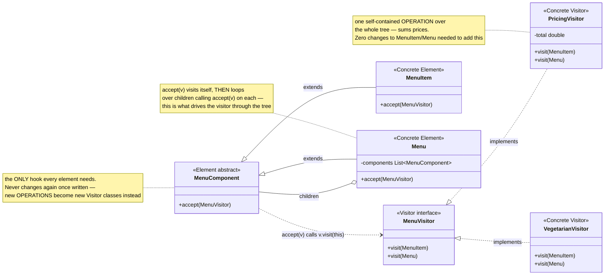
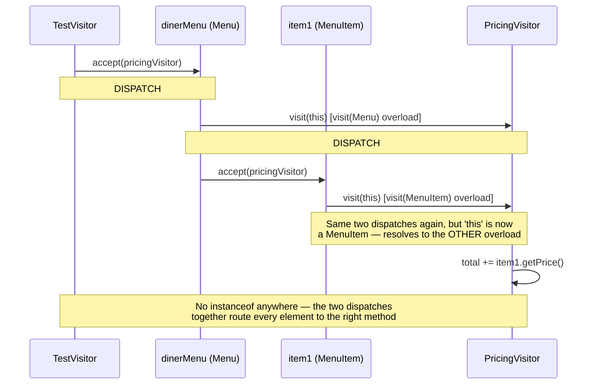

# Visitor Design Pattern

[← Not sure this is the right pattern? See the decision tree](../../../../PATTERN_DECISION_TREE.md) ·
[quick reference for all 23](../../../../PATTERN_DECISION_TREE.md#user-content-every-pattern-grouped-by-pattern)

*Example: new operations over the Diner Menu tree — a Head-First-style
example built for this repo, reusing the book's own menu domain. Head First
Design Patterns only covers Visitor briefly, in its "leftover patterns"
chapter, without a fully worked example, so this isn't a verbatim book example.*

## What it is
Visitor represents an operation to be performed on the elements of an object
structure. It lets you define a new operation without changing the classes
of the elements on which it operates — by moving the operation itself into a
separate visitor object, and having each element merely accept a visitor.

## Problem it solves
A menu tree (`MenuItem`s and nested `Menu`s) might need several unrelated
operations performed on it over time: total pricing today, printing
vegetarian items tomorrow, maybe nutritional summaries next month. Adding
each one as a new method on `MenuItem`/`Menu` means editing those classes
every single time a new operation is needed, and clutters them with logic
that has nothing to do with being "a menu item." Visitor solves this by
writing each operation as its own class implementing a shared interface; the
element classes get exactly one new method, `accept(visitor)`, once — and
never again.

## Participants (mapped to this package)

| Role                | Type            | Class in this package             |
|---------------------|-----------------|--------------------------------------|
| Visitor              | interface       | `MenuVisitor`                          |
| Concrete Visitor      | class           | `PricingVisitor`, `VegetarianVisitor`  |
| Element (abstract)    | abstract class  | `MenuComponent`                        |
| Concrete Element      | class           | `MenuItem`, `Menu`                     |
| Client                | class           | `TestVisitor`                          |

- **Visitor (`MenuVisitor`)** — declares one overloaded `visit(...)` method
  per concrete element type (`visit(MenuItem)`, `visit(Menu)`).
- **Concrete Visitors (`PricingVisitor`, `VegetarianVisitor`)** — each is one
  self-contained operation: `PricingVisitor` sums up prices across every
  `MenuItem` it visits; `VegetarianVisitor` prints every vegetarian item it finds.
- **Element (`MenuComponent`)** — declares `accept(visitor)`, the single hook
  every element supports.
- **Concrete Elements (`MenuItem`, `Menu`)** — each implements `accept()` by
  calling `visitor.visit(this)`; `Menu` additionally loops over its children
  and calls `accept()` on each of them, driving the visitor through the whole tree.
- **Client (`TestVisitor`)** — builds the tree once, then runs each visitor
  over it independently with a single `root.accept(visitor)` call.

## Diagrams

*These two diagrams are meant to be readable on their own — every box is
labeled with its pattern role, and notes spell out what each one actually
does, so you shouldn't need the prose above to follow them.*

### UML class diagram



**How to read this:** adding a brand-new operation (nutritional summary, tax
calculation, whatever) never touches `MenuItem` or `Menu` again — it's just
one more class implementing `MenuVisitor`. The only time those two DO need
updating is if a brand-new *element type* is added to the tree.

### Workflow (sequence diagram — double dispatch)



## Architecture / Flow

```
                    MenuVisitor (interface)
                    ---------------------------------
                    + visit(MenuItem)
                    + visit(Menu)
                       ▲                    ▲
                       │ implements          │ implements
                PricingVisitor         VegetarianVisitor


                    MenuComponent (Element, abstract)
                    ---------------------------------
                    + accept(MenuVisitor)
                       ▲                    ▲
                       │ extends             │ extends
                   MenuItem                Menu
              accept(v) {              - components: List<MenuComponent>
                 v.visit(this);        accept(v) {
              }                            v.visit(this);
                                            for (c : components) c.accept(v);  <-- recurses
                                        }
```

### Double dispatch — how the right `visit(...)` overload gets picked

1. `component.accept(visitor)` is called — which `accept()` runs is decided
   by `component`'s actual runtime type (`MenuItem.accept()` or `Menu.accept()`)
   — that's the first dispatch, ordinary polymorphism.
2. Inside `accept()`, the element calls `visitor.visit(this)` — and because
   `this` has a known, specific compile-time type at that call site
   (`MenuItem` inside `MenuItem.accept()`, `Menu` inside `Menu.accept()`),
   Java's overload resolution picks the matching `visit(MenuItem)` or
   `visit(Menu)` method — that's the second dispatch.
3. Together, these two dispatches route every element to the correct visitor
   method, without a single `instanceof` check anywhere.

### Step-by-step call flow (`dinerMenu.accept(pricingVisitor)`)

```
dinerMenu.accept(pricingVisitor)          [Menu.accept()]
   ├──> pricingVisitor.visit(dinerMenu)   [visit(Menu) — no-op for pricing]
   ├──> item1.accept(pricingVisitor)      [MenuItem.accept()]
   │        └──> pricingVisitor.visit(item1)   [visit(MenuItem) — adds price]
   ├──> item2.accept(pricingVisitor)
   │        └──> pricingVisitor.visit(item2)   [adds price]
   └──> dessertMenu.accept(pricingVisitor)      [Menu.accept() again — recursion]
            ├──> pricingVisitor.visit(dessertMenu)
            └──> item3.accept(pricingVisitor)
                     └──> pricingVisitor.visit(item3)   [adds price]

pricingVisitor.getTotal() --> sum of item1+item2+item3's prices
```

Swapping in `vegetarianVisitor` instead runs the exact same tree walk, but
each `visit(...)` call now checks `isVegetarian()` and prints a line, instead
of accumulating a price — a completely different operation, with zero
changes to `MenuItem` or `Menu`.

## Why this matters (the point of the pattern)
- New operations (`PricingVisitor`, `VegetarianVisitor`, and any future one)
  are added as new classes — `MenuItem` and `Menu` never change again once
  `accept()` exists.
- Each operation's logic lives in one cohesive class instead of being spread
  across methods on every element type.
- The tree-walking logic (how to reach every node) stays in `accept()`,
  written once; each visitor only has to say *what* to do at each node, not
  *how to get there*.

## Quick recall checklist
- [ ] Visitor interface → one overloaded `visit(...)` per concrete element type (`MenuVisitor`)
- [ ] Concrete Visitor → one self-contained operation, implemented per element type (`PricingVisitor`, `VegetarianVisitor`)
- [ ] Element → exposes `accept(visitor)`, calls `visitor.visit(this)` (`MenuItem`, `Menu`)
- [ ] Double dispatch → `accept()` picks the element's own method; `visit(this)` picks the matching overload — together they avoid `instanceof`
- [ ] New operation = new Visitor class; new element type = the one case where every existing Visitor DOES need updating
