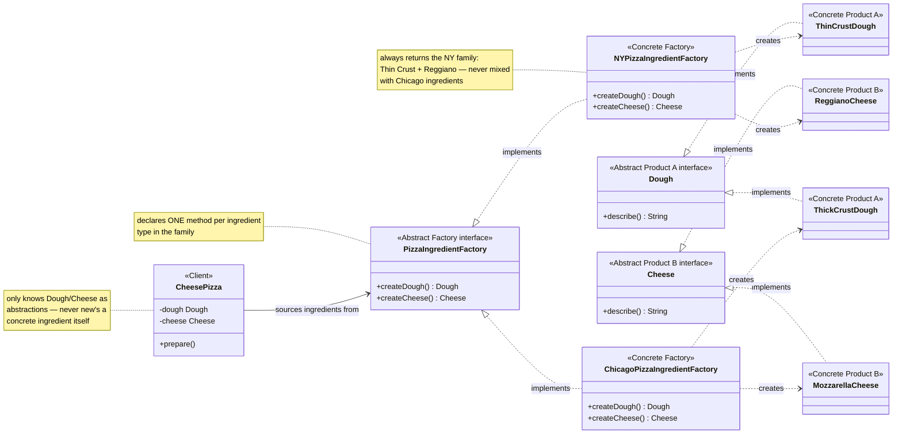
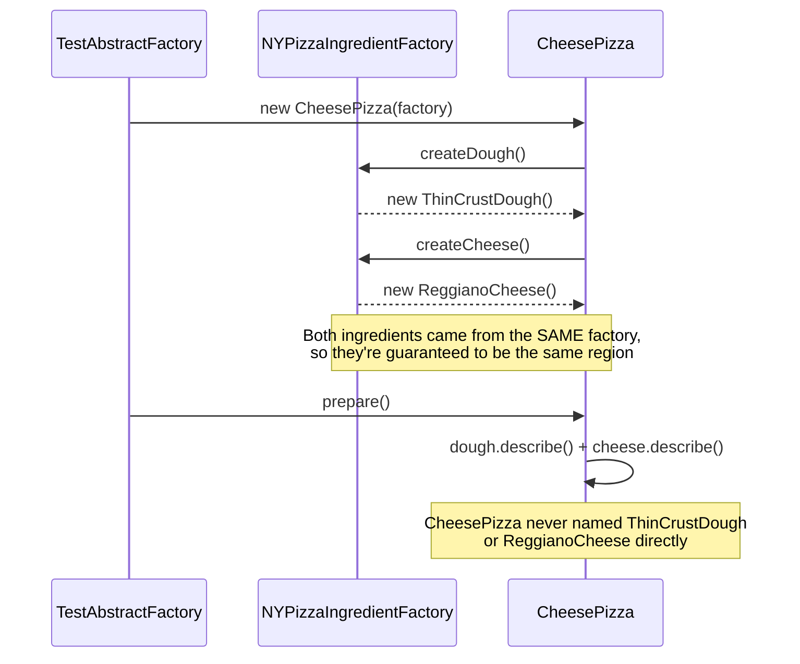

# Abstract Factory Design Pattern

[← Not sure this is the right pattern? See the decision tree](../../../../PATTERN_DECISION_TREE.md) ·
[quick reference for all 23](../../../../PATTERN_DECISION_TREE.md#user-content-every-pattern-grouped-by-pattern)

*Example: the Pizza Ingredient Factory, from Head First Design Patterns.*

## What it is
Abstract Factory provides an interface for creating **families of related objects**
without specifying their concrete classes. Where Factory Method (see `../factory/`)
creates *one* product via an overridden method, Abstract Factory creates
*several related products* via one factory object — and guarantees they're
all mutually compatible (e.g. never accidentally mixing NY dough with
Chicago cheese).

## Problem it solves
A pizza's ingredients need to match its region — NY pizzas use thin crust and
Reggiano cheese, Chicago pizzas use thick crust and mozzarella. If ingredient
creation is scattered with plain `new ThinCrustDough()` / `new MozzarellaCheese()`
calls, it's easy to end up with a mismatched pizza (Chicago dough with NY
cheese), and adding a new region means hunting down every creation site.
Abstract Factory centralizes creation of the whole ingredient family behind
one object, so a pizza can't accidentally mix regions.

## Participants (mapped to this package)

| Role                | Type      | Class in this package                                    |
|---------------------|-----------|-------------------------------------------------------------|
| Abstract Factory     | interface | `PizzaIngredientFactory`                                     |
| Concrete Factory     | class     | `NYPizzaIngredientFactory`, `ChicagoPizzaIngredientFactory`  |
| Abstract Product A   | interface | `Dough`                                                      |
| Abstract Product B   | interface | `Cheese`                                                     |
| Concrete Product A   | class     | `ThinCrustDough`, `ThickCrustDough`                           |
| Concrete Product B   | class     | `ReggianoCheese`, `MozzarellaCheese`                          |
| Client               | class     | `CheesePizza` (used by `TestAbstractFactory`)                |

- **Abstract Factory (`PizzaIngredientFactory`)** — declares one creation method
  per ingredient type in the family: `createDough()`, `createCheese()`.
- **Concrete Factories (`NYPizzaIngredientFactory`, `ChicagoPizzaIngredientFactory`)**
  — each implements both methods, always returning ingredients from the *same* region.
- **Abstract Products (`Dough`, `Cheese`)** — the common interfaces the client
  programs against.
- **Concrete Products (`ThinCrustDough`/`ReggianoCheese`,
  `ThickCrustDough`/`MozzarellaCheese`)** — the actual region-specific implementations.
- **Client (`CheesePizza`)** — is given a `PizzaIngredientFactory` and sources
  its ingredients using only `Dough`/`Cheese`, never knowing (or caring) which
  region it got.

## Diagrams

*These two diagrams are meant to be readable on their own — every box is
labeled with its pattern role, and notes spell out what each one actually
does, so you shouldn't need the prose above to follow them.*

### UML class diagram



**How to read this:** every concrete factory (`NYPizzaIngredientFactory`,
`ChicagoPizzaIngredientFactory`) returns a matching *pair* of ingredients —
that pairing is the entire point. `CheesePizza` only ever talks to the
abstract `PizzaIngredientFactory`/`Dough`/`Cheese` types, so it can never end
up holding a mismatched NY-dough + Chicago-cheese combination.

### Workflow (sequence diagram)



## Architecture / Flow

```
             PizzaIngredientFactory (Abstract Factory)
             -----------------------------------------
             + createDough()  : Dough
             + createCheese() : Cheese
                          ▲
                          │ implements
            ┌─────────────┴─────────────────┐
            │                                │
    NYPizzaIngredientFactory        ChicagoPizzaIngredientFactory
    createDough()  -> ThinCrustDough      createDough()  -> ThickCrustDough
    createCheese() -> ReggianoCheese      createCheese() -> MozzarellaCheese


      Dough (Abstract Product A)              Cheese (Abstract Product B)
      ----------------------------            -----------------------------
      + describe()                             + describe()
           ▲            ▲                           ▲              ▲
           │            │                           │              │
   ThinCrustDough  ThickCrustDough           ReggianoCheese   MozzarellaCheese
```

### Step-by-step call flow (using `NYPizzaIngredientFactory`)

1. `TestAbstractFactory.configure("NY")` sets
   `ingredientFactory = new NYPizzaIngredientFactory();`
   The client only ever refers to the `PizzaIngredientFactory` type.
2. `new CheesePizza(ingredientFactory)` runs:
   - `ingredientFactory.createDough()` → dispatched to `NYPizzaIngredientFactory.createDough()`
     → returns `new ThinCrustDough()`
   - `ingredientFactory.createCheese()` → dispatched to `NYPizzaIngredientFactory.createCheese()`
     → returns `new ReggianoCheese()`
   - Both are stored as the abstract `Dough` / `Cheese` types on `CheesePizza`.
3. `pizza.prepare()` calls `dough.describe()` and `cheese.describe()` —
   `CheesePizza` never touches `ThinCrustDough` or `ReggianoCheese` by name.

```
TestAbstractFactory --configure()--> new NYPizzaIngredientFactory()
TestAbstractFactory --> new CheesePizza(ingredientFactory)
CheesePizza constructor
   ├──> ingredientFactory.createDough()   [-> NYPizzaIngredientFactory -> new ThinCrustDough()]
   └──> ingredientFactory.createCheese()  [-> NYPizzaIngredientFactory -> new ReggianoCheese()]

pizza.prepare()
   └──> prints dough.describe() + cheese.describe()
```

Swap `configure("Chicago")` and the exact same `CheesePizza` code now assembles
itself from a `ThickCrustDough` + `MozzarellaCheese` pair — with zero changes
to `CheesePizza` and no risk of ending up with NY dough next to Chicago cheese.

## Factory Method vs. Abstract Factory (quick contrast)

| Aspect              | Factory Method (`../factory/`)                     | Abstract Factory (this package)              |
|----------------------|------------------------------------------------------|-----------------------------------------------|
| Creates              | one product (a whole `Pizza`)                        | a family of related products (`Dough` + `Cheese`) |
| Mechanism            | subclass overrides one method (`createPizza()`)      | one factory *object* with multiple creation methods |
| Consistency guarantee | none needed (only one product)                       | ensures all ingredients from a factory match (all NY or all Chicago) |
| Typical use          | one class hierarchy needs pluggable creation          | multiple related class hierarchies must vary together |

## Why this matters (the point of the pattern)
- Guarantees **regional consistency** — a client using `NYPizzaIngredientFactory`
  can never accidentally get `MozzarellaCheese`.
- Client (`CheesePizza`) depends only on abstractions (`PizzaIngredientFactory`,
  `Dough`, `Cheese`) — Dependency Inversion in action.
- Adding a new region (e.g. `CaliforniaPizzaIngredientFactory` + its own dough
  and cheese) requires zero changes to `CheesePizza` — Open/Closed Principle.

## Quick recall checklist
- [ ] Abstract Factory → declares one method per ingredient type (`PizzaIngredientFactory`)
- [ ] Concrete Factories → each returns one whole matching region (`NYPizzaIngredientFactory`, `ChicagoPizzaIngredientFactory`)
- [ ] Abstract Products → common interfaces per ingredient type (`Dough`, `Cheese`)
- [ ] Concrete Products → region-specific implementations (`ThinCrustDough`/`ReggianoCheese`, `ThickCrustDough`/`MozzarellaCheese`)
- [ ] Client → takes a factory, uses only abstract product types, never `new`s a concrete ingredient itself
