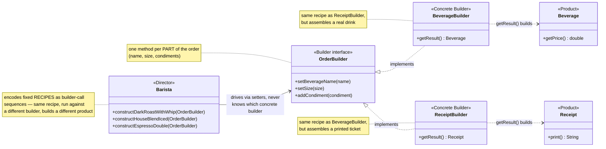
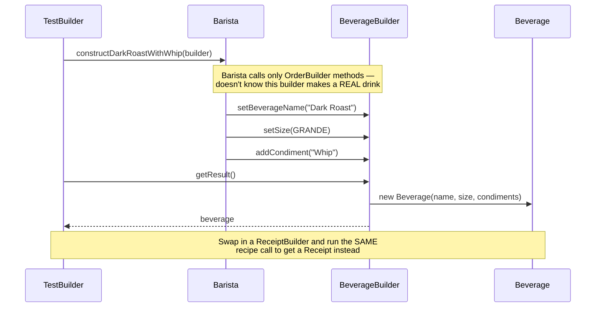

# Builder Design Pattern

[← Not sure this is the right pattern? See the decision tree](../../../../PATTERN_DECISION_TREE.md)

*Example: a Starbuzz Coffee order — a Head-First-style example built for this
repo. Head First Design Patterns doesn't give Builder a fully worked chapter
example (it's covered briefly in the "leftover patterns" chapter), so this
reuses the book's own Starbuzz Coffee domain from its Decorator chapter,
rather than quoting the book directly.*

## What it is
Builder separates the construction of a complex object from its representation,
so the same step-by-step construction process can produce different
representations. Instead of one giant telescoping constructor
(`new Beverage(name, size, condiments)` with a `List` you'd have to build up
beforehand), construction is broken into individual steps (`setSize()`,
`addCondiment()`, ...) that get called in whatever order/combination is needed.

## Problem it solves
A coffee order has a name, a size, and a variable number of condiments — not
every drink needs the same setup (a plain espresso needs zero condiments; a
dark roast needs one; another order might need three). A single constructor
covering every combination either explodes into many overloaded constructors,
or forces the caller to build a `List<String>` by hand before calling `new`.
Builder fixes this by exposing one call per part; a `Barista` can then encode
reusable "recipes" (dark roast with whip, iced house blend, plain espresso)
that call only the steps that recipe needs.

## Participants (mapped to this package)

| Role              | Type      | Class in this package                          |
|-------------------|-----------|--------------------------------------------------|
| Builder            | interface | `OrderBuilder`                                    |
| Concrete Builder   | class     | `BeverageBuilder`, `ReceiptBuilder`               |
| Product            | class     | `Beverage`, `Receipt`                             |
| Part               | class/enum| `Size`, condiments (`String`)                     |
| Director           | class     | `Barista`                                         |
| Client             | class     | `TestBuilder`                                     |

- **Builder (`OrderBuilder`)** — declares one method per part (`setBeverageName`,
  `setSize`, `addCondiment`).
- **Concrete Builders (`BeverageBuilder`, `ReceiptBuilder`)** — each collects the
  same parts, but `getResult()` assembles a *different* product from them:
  `BeverageBuilder` builds an actual `Beverage`; `ReceiptBuilder` builds a
  `Receipt` (printed order ticket) describing that same order.
- **Products (`Beverage`, `Receipt`)** — the complex objects being assembled.
  Immutable once built (all fields set once via constructor).
- **Parts (`Size`, condiment strings)** — the individual pieces passed into
  the builder's setters.
- **Director (`Barista`)** — encodes reusable build "recipes"
  (`constructDarkRoastWithWhip`, `constructHouseBlendIced`, `constructEspressoDouble`)
  as a fixed sequence of builder calls. It works with the abstract `OrderBuilder`
  interface, so it never needs to know if it's building a real beverage or a receipt.
- **Client (`TestBuilder`)** — picks a concrete builder, hands it to the
  `Barista`, then calls `getResult()` to get the finished product.

## Diagrams

*These two diagrams are meant to be readable on their own — every box is
labeled with its pattern role, and notes spell out what each one actually
does, so you shouldn't need the prose above to follow them.*

### UML class diagram



**How to read this:** `Barista` only ever calls methods on the `OrderBuilder`
interface — it has no idea whether it's talking to a `BeverageBuilder` or a
`ReceiptBuilder`. That's what lets the *exact same* recipe method
(`constructDarkRoastWithWhip`) produce two completely different products
depending only on which builder gets passed in.

### Workflow (sequence diagram)



## Architecture / Flow

```
              Barista
              --------------------------------
              + constructDarkRoastWithWhip(OrderBuilder)
              + constructHouseBlendIced(OrderBuilder)
              + constructEspressoDouble(OrderBuilder)
                        │
                        │ drives (calls setters on)
                        ▼
                   OrderBuilder (interface)
              --------------------------------
              + setBeverageName(String)
              + setSize(Size)
              + addCondiment(String)
                        ▲
                        │ implements
          ┌─────────────┴──────────────┐
          │                             │
     BeverageBuilder              ReceiptBuilder
     getResult() : Beverage       getResult() : Receipt
          │                             │
          ▼                             ▼
        Beverage                      Receipt
   (the actual drink to serve)   (printable order ticket)
```

### Step-by-step call flow (building a dark roast with whip)

1. `TestBuilder` creates a `Barista` and a `BeverageBuilder`.
2. `barista.constructDarkRoastWithWhip(builder)` runs a fixed sequence:
   - `builder.setBeverageName("Dark Roast")`
   - `builder.setSize(GRANDE)`
   - `builder.addCondiment("Whip")`
   The `Barista` only calls methods declared on `OrderBuilder` — it has no
   idea which concrete builder (or product) is behind the interface.
3. `builder.getResult()` on `BeverageBuilder` assembles all the accumulated
   parts into a real `Beverage`, whose `getPrice()` adds a per-condiment charge
   on top of the base price.
4. To get a receipt for the *same* order, `TestBuilder` creates a
   `ReceiptBuilder` and runs the exact same
   `barista.constructDarkRoastWithWhip(receiptBuilder)` call — same recipe,
   different builder, different product (`Receipt` instead of `Beverage`).

```
TestBuilder --> new Barista(), new BeverageBuilder()
TestBuilder --> barista.constructDarkRoastWithWhip(beverageBuilder)
Barista.constructDarkRoastWithWhip(builder)
   ├──> builder.setBeverageName("Dark Roast")
   ├──> builder.setSize(GRANDE)
   └──> builder.addCondiment("Whip")

TestBuilder --> beverageBuilder.getResult()  --> new Beverage(...)   [real product]

TestBuilder --> new ReceiptBuilder()
TestBuilder --> barista.constructDarkRoastWithWhip(receiptBuilder)   [same recipe again]
TestBuilder --> receiptBuilder.getResult() --> new Receipt(...)      [different product]
```

## Alternative: Fluent (Chained-Setter) Builder
This package also includes a fluent variant in [`fluent/`](fluent/FluentBuilder_README.md) —
same `Beverage` product, but setters return `this` so calls chain
(`.name(x).size(GRANDE).condiment("Whip")...build()`) instead of needing a
separate `Barista` object. See that README for the full contrast.

## Why this matters (the point of the pattern)
- No telescoping constructors — each part is set independently, and orders
  with zero condiments (like the plain espresso) simply skip `addCondiment()` entirely.
- The construction *recipe* (`Barista`) is decoupled from *how* each part gets
  turned into a product (`OrderBuilder`) — the same recipe reused for
  `Beverage` and `Receipt` is the clearest proof of this.
- Product classes (`Beverage`, `Receipt`) stay immutable — all fields are set
  once via the final constructor call inside `getResult()`.

## Quick recall checklist
- [ ] Builder → one method per part of the product (`OrderBuilder` interface)
- [ ] Concrete Builder → collects parts and assembles a specific product in `getResult()` (`BeverageBuilder`, `ReceiptBuilder`)
- [ ] Product → the complex object being built (`Beverage`, `Receipt`)
- [ ] Director → encodes a fixed build sequence, reusable across builders (`Barista`)
- [ ] Client → picks a builder + director combo and reads off `getResult()` (`TestBuilder`)
