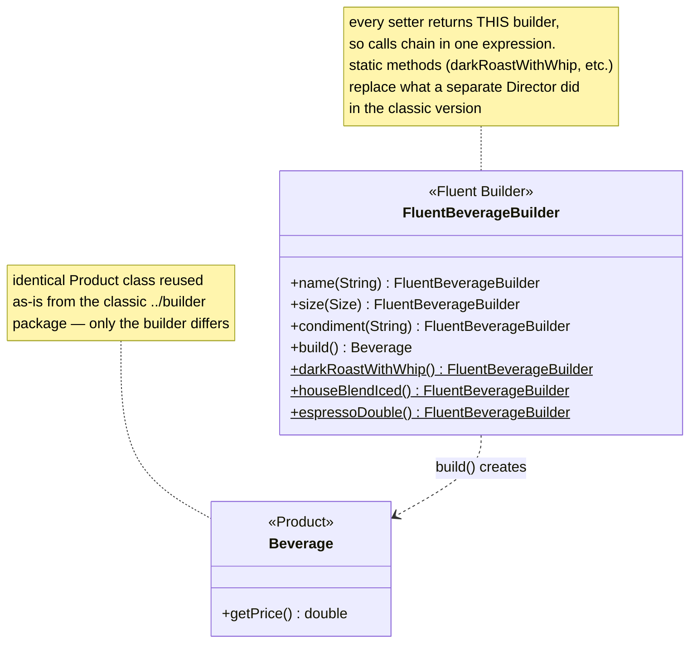
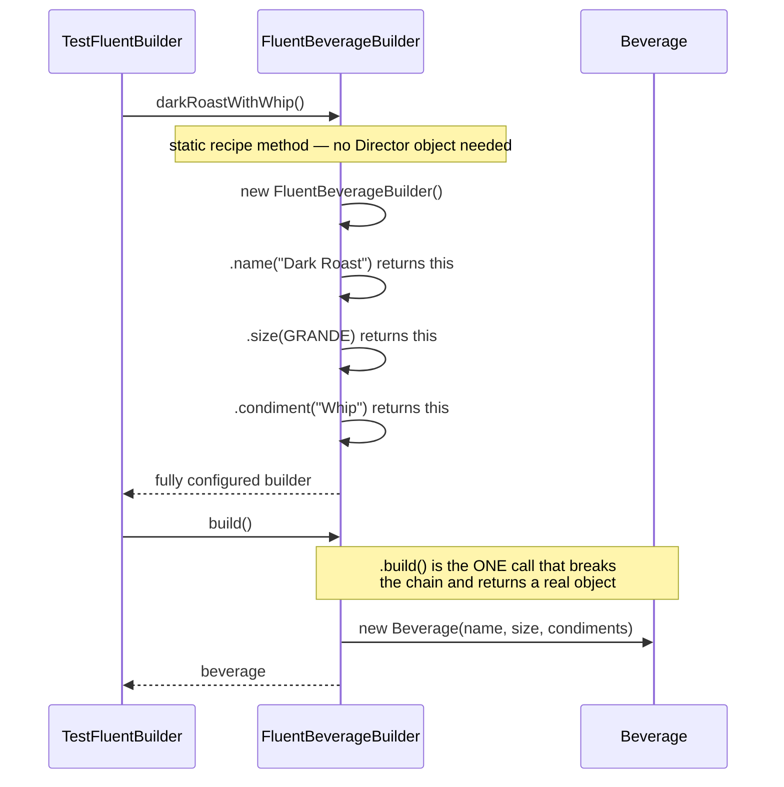

# Builder Pattern — Fluent (Chained-Setter) Variant

[← Not sure this is the right pattern? See the decision tree](../../../../../PATTERN_DECISION_TREE.md) ·
[quick reference for all 23](../../../../../PATTERN_DECISION_TREE.md#user-content-every-pattern-grouped-by-pattern)

This is an alternative implementation of the same Builder pattern as
[`../Builder_README.md`](../Builder_README.md), built to a more "modern Java"
style: chained setters instead of a separate `Barista`. Same product
(`Beverage`, reused from the parent `builder` package), different builder ergonomics.

## What's different from the classic version

| Aspect                | Classic (`../BeverageBuilder.java`)          | Fluent (`FluentBeverageBuilder.java`)                    |
|------------------------|-----------------------------------------------|--------------------------------------------------------|
| Setter return type     | `void`                                        | `FluentBeverageBuilder` (returns `this`)                 |
| Calling style          | one statement per setter                      | chained: `.name(x).size(GRANDE).condiment("Whip")...`    |
| Terminal method        | `getResult()`                                 | `build()`                                               |
| Reusable recipes        | separate `Barista` object with recipe methods  | static factory methods on the builder itself (`darkRoastWithWhip()`, `houseBlendIced()`, `espressoDouble()`) |
| Extra object needed?   | yes — a `Barista` instance                     | no — recipes are just static methods                    |

The **product** (`Beverage`) and its **parts** (`Size`, condiment strings) are
reused as-is from the parent `designpatterns.creational.builder` package —
only the *builder* changes shape.

## Diagrams

*These two diagrams are meant to be readable on their own — every box is
labeled with its pattern role, and notes spell out what each one actually
does, so you shouldn't need the prose above to follow them.*

### UML class diagram



**How to read this:** there's no separate Director class here — the
recipes (`darkRoastWithWhip()`, etc.) are static factory methods living
directly on the builder. Every non-static method returns `this`, which is
the only thing that makes `.name(x).size(y).condiment(z)` chaining possible;
`.build()` is the one method that breaks the chain and hands back the
actual `Beverage`.

### Workflow (sequence diagram)



## Architecture / Flow

```
        FluentBeverageBuilder
        --------------------------------------------
        + name(String)             : FluentBeverageBuilder
        + size(Size)                : FluentBeverageBuilder
        + condiment(String)         : FluentBeverageBuilder
        + build()                   : Beverage   <-- terminal call, ends the chain

        static darkRoastWithWhip() / houseBlendIced() / espressoDouble()
              --> pre-populated FluentBeverageBuilder
              (these replace what Barista did in the classic version)
```

### Call flow — recipe style

```
FluentBeverageBuilder.darkRoastWithWhip()
   ├──> new FluentBeverageBuilder()
   ├──> .name("Dark Roast")        --> returns this
   ├──> .size(GRANDE)               --> returns this
   └──> .condiment("Whip")          --> returns this (fully configured builder)

.build() --> new Beverage(name, size, condiments)
```

### Call flow — ad-hoc style (no recipe)

```
new FluentBeverageBuilder()
   .name("House Blend")
   .size(TALL)
   .condiment("Soy")
   .condiment("Mocha")
   .build()
```

Each call in the chain both mutates the builder's internal fields *and*
returns the same builder instance (`this`), which is what allows the next call
to be appended directly onto it. `.build()` is the one method that breaks the
chain and returns the actual `Beverage` instead of `this`.

## Why choose this over the classic version
- Reads top-to-bottom like a spec of the order being built — no separate
  `Barista` object required for one-off construction.
- Matches the style of common real-world Java builders (`StringBuilder`,
  Lombok's `@Builder`, HTTP client builders, etc.), so it's the more
  "idiomatic modern Java" choice.
- Still supports reusable recipes (`darkRoastWithWhip()`, etc.) — they
  just live as static factory methods instead of a separate `Barista` class.

## When the classic (`Barista`) version is still worth it
- When the same build *sequence* needs to run against genuinely different
  builder implementations producing different product types — like this
  repo's `BeverageBuilder` vs `ReceiptBuilder` (a real `Beverage` vs. a
  printable `Receipt`). A `Barista` recipe is written once against the
  `OrderBuilder` interface and works for both; a fluent builder's static
  recipe methods are tied to one concrete builder/product.

## Quick recall checklist
- [ ] Fluent setter → same job as classic setter, but returns `this` instead of `void`
- [ ] `.build()` → terminal method, assembles parts into the product and ends the chain
- [ ] Static recipe methods (`darkRoastWithWhip()`, etc.) → fluent's replacement for `Barista`
- [ ] Trade-off → fluent is more ergonomic for a single product type; classic `Barista` wins when one recipe must drive multiple unrelated product types
