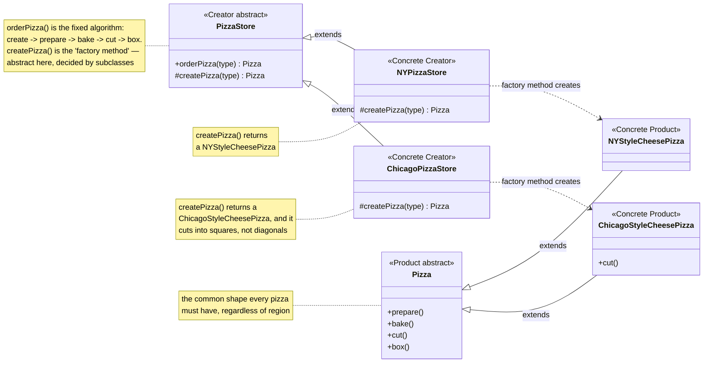
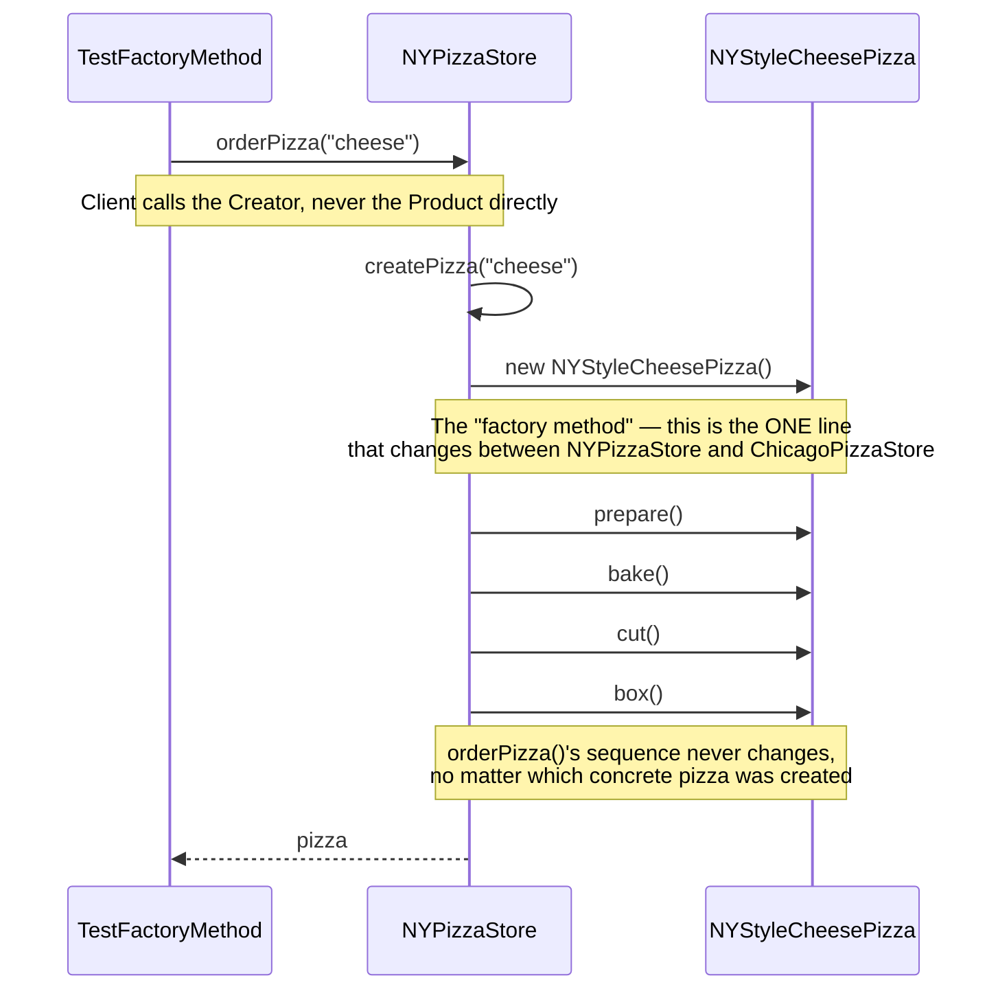

# Factory Method Design Pattern

[← Not sure this is the right pattern? See the decision tree](../../../../PATTERN_DECISION_TREE.md)

*Example: the Pizza Store, from Head First Design Patterns.*

## What it is
Factory Method defines a method for creating an object, but lets subclasses decide
which concrete class to instantiate. The client code works only with an abstract
Creator and abstract Product — it never depends on concrete classes directly.

## Problem it solves
A pizza store needs to make pizzas, but the exact style of pizza (NY thin-crust,
Chicago deep-dish, ...) shouldn't be hardcoded into the ordering logic. If
`orderPizza()` did `new NYStyleCheesePizza()` directly, every new region would
mean editing that method. Factory Method moves the "which pizza?" decision into
one overridable method (`createPizza()`), so `orderPizza()` never has to change.

## Participants (mapped to this package)

| Role              | Type      | Class in this package                          |
|-------------------|-----------|--------------------------------------------------|
| Product           | abstract class | `Pizza`                                     |
| Concrete Product  | class     | `NYStyleCheesePizza`, `ChicagoStyleCheesePizza`  |
| Creator           | abstract class | `PizzaStore`                                |
| Concrete Creator  | class     | `NYPizzaStore`, `ChicagoPizzaStore`             |
| Client            | class     | `TestFactoryMethod`                             |

- **Product (`Pizza`)** — the common steps every pizza goes through
  (`prepare()`, `bake()`, `cut()`, `box()`).
- **Concrete Products (`NYStyleCheesePizza`, `ChicagoStyleCheesePizza`)** —
  regional pizzas with their own dough/sauce/toppings; Chicago also overrides
  `cut()` to slice into squares instead of diagonals.
- **Creator (`PizzaStore`)** — declares the factory method `createPizza(type)`
  and uses it inside `orderPizza(type)`. It doesn't know which pizza will be returned.
- **Concrete Creators (`NYPizzaStore`, `ChicagoPizzaStore`)** — override
  `createPizza(type)` to return the matching regional pizza.
- **Client (`TestFactoryMethod`)** — picks a `PizzaStore` subclass at runtime
  and calls `orderPizza()`, without ever referencing `NYStyleCheesePizza` /
  `ChicagoStyleCheesePizza` directly.

## Diagrams

*These two diagrams are meant to be readable on their own — every box is
labeled with its pattern role, and notes spell out what each one actually
does, so you shouldn't need the prose above to follow them.*

### UML class diagram



**How to read this:** `PizzaStore` never names a concrete pizza class — its
`orderPizza()` method calls the abstract `createPizza()` and lets whichever
subclass is actually running fill in the blank. `NYPizzaStore` and
`ChicagoPizzaStore` are interchangeable from the client's point of view; each
just wires `createPizza()` to a different `Pizza` subclass.

### Workflow (sequence diagram)



## Architecture / Flow

```
        PizzaStore (abstract Creator)
        --------------------------------
        + orderPizza(String type) : Pizza
        # createPizza(String type) : Pizza   <-- abstract "factory method"
              ▲
              │ extends
      ┌───────┴────────┐
      │                │
 NYPizzaStore     ChicagoPizzaStore
 createPizza()    createPizza()
   returns          returns
 NYStyleCheesePizza  ChicagoStyleCheesePizza
      │                │
      ▼                ▼
   Pizza (Product, abstract)
   --------------------------
   + prepare()
   + bake()
   + cut()
   + box()
      ▲                ▲
      │ extends         │ extends
 NYStyleCheesePizza  ChicagoStyleCheesePizza
```

### Step-by-step call flow (using `NYPizzaStore`)

1. `TestFactoryMethod.configure("NY")` sets `store = new NYPizzaStore();`
   The client only knows about `PizzaStore`, not `NYPizzaStore` directly.
2. `TestFactoryMethod` calls `store.orderPizza("cheese")`.
3. Inside `PizzaStore.orderPizza(type)`:
   - calls `createPizza(type)` — a polymorphic call, dispatched to whichever
     subclass's override runs at runtime.
   - Because `store` is actually an `NYPizzaStore`, `NYPizzaStore.createPizza()`
     runs and returns a `new NYStyleCheesePizza()`.
4. `orderPizza()` then drives the returned pizza through
   `prepare() → bake() → cut() → box()` and returns it to the client.

```
TestFactoryMethod --configure()--> new NYPizzaStore()
TestFactoryMethod --> store.orderPizza("cheese")
PizzaStore.orderPizza(type)
   │
   ├──> createPizza(type)  [dispatched to NYPizzaStore.createPizza()]
   │        └──> returns new NYStyleCheesePizza()
   │
   ├──> pizza.prepare()   [runs NYStyleCheesePizza's ingredients]
   ├──> pizza.bake()
   ├──> pizza.cut()       [diagonal slices]
   └──> pizza.box()
```

Swap `configure("Chicago")` and the exact same `orderPizza()` code path now
creates a `ChicagoStyleCheesePizza` and cuts it into squares instead — with
zero changes to `PizzaStore.orderPizza()` or `TestFactoryMethod`.

## Why this matters (the point of the pattern)
- `PizzaStore.orderPizza()` is closed for modification but open for extension
  (Open/Closed Principle) — adding a new region (e.g. `CaliforniaPizzaStore` +
  `CaliforniaStyleCheesePizza`) requires zero changes to existing classes.
- The client (`TestFactoryMethod`) depends only on abstractions (`PizzaStore`,
  `Pizza`), not concrete classes — this is Dependency Inversion in action.
- Pizza-creation logic is centralized in one method (`createPizza()`) per
  store, instead of scattered `new` calls throughout the codebase.

## Quick recall checklist
- [ ] Product (abstract) → what the created objects must do (`Pizza`)
- [ ] Concrete Products → actual implementations (`NYStyleCheesePizza`, `ChicagoStyleCheesePizza`)
- [ ] Creator (abstract) → has the factory method + business logic that uses the product (`PizzaStore`)
- [ ] Concrete Creators → decide *which* product to instantiate (`NYPizzaStore`, `ChicagoPizzaStore`)
- [ ] Client → talks only to abstract Creator/Product, never `new`s a concrete product itself
