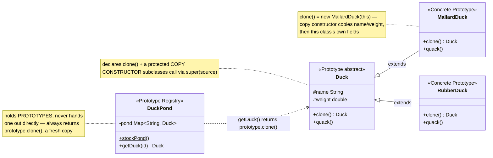
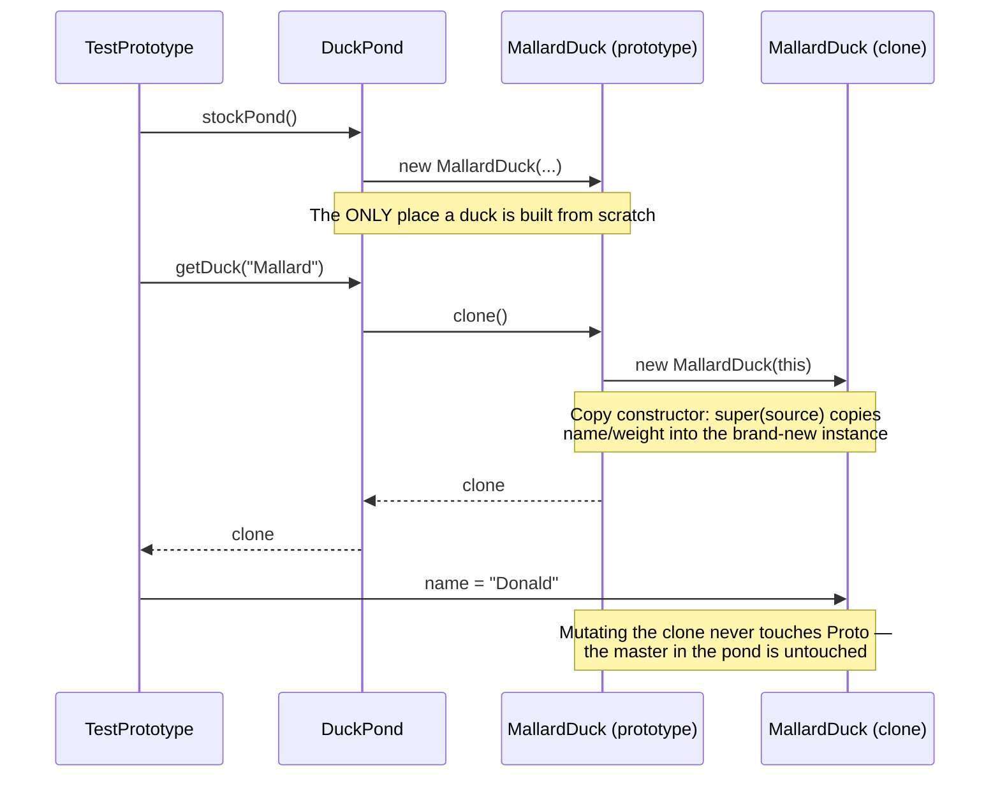

# Prototype Design Pattern

*Example: cloning ducks in a pond — a Head-First-style example built for this
repo. Head First Design Patterns only covers Prototype briefly, in its
"leftover patterns" chapter, without a fully worked-out example — so this
reuses the book's own recurring Duck domain (seen in its Strategy, Decorator,
Observer, and Adapter chapters) rather than quoting the book directly.*

## What it is
Prototype lets you copy existing objects without making your code depend on
their concrete classes. Instead of building an object from scratch via `new` +
a constructor (which requires knowing the concrete class and re-supplying every
field), you ask an existing object to **clone itself**.

## Problem it solves
Sometimes constructing an object from scratch is expensive (fetching from a DB,
heavy computation) or you simply want "one more just like this one" — without
caring which concrete subclass it is. If client code only has a `Duck`
reference (not knowing if it's a `MallardDuck` or `RubberDuck`), it can't call
`new MallardDuck(...)` directly. `duck.clone()` works regardless of the
concrete type, and each class is responsible for correctly copying its own fields.

## Participants (mapped to this package)

| Role                | Type            | Class in this package        |
|----------------------|-----------------|--------------------------------|
| Prototype             | abstract class  | `Duck`                        |
| Concrete Prototype    | class           | `MallardDuck`, `RubberDuck`   |
| Prototype Registry    | class           | `DuckPond`                    |
| Client                | class           | `TestPrototype`               |

- **Prototype (`Duck`)** — declares the abstract `clone()` method, and holds
  the fields (`name`, `weight`) common to every duck, plus a protected copy
  constructor subclasses call via `super(source)`.
- **Concrete Prototypes (`MallardDuck`, `RubberDuck`)** — each implements
  `clone()` by calling its own copy constructor, and that copy constructor
  calls `super(source)` first so the base fields get copied too. Each also
  has its own `quack()` behavior (`"Quack!"` vs `"Squeak!"`).
- **Prototype Registry (`DuckPond`)** — a common extension of the pattern:
  stores one pre-configured prototype per key so callers can fetch a ready-made
  clone by name (`"Mallard"`, `"Rubber"`) instead of configuring one from
  scratch every time.
- **Client (`TestPrototype`)** — asks the pond for ducks and clones them,
  never calling `new MallardDuck()`/`new RubberDuck()` itself.

## Diagrams

*These two diagrams are meant to be readable on their own — every box is
labeled with its pattern role, and notes spell out what each one actually
does, so you shouldn't need the prose above to follow them.*

### UML class diagram



**How to read this:** `DuckPond` stores one pre-built "master" duck per
species. Every time `getDuck(...)` is called, it hands back a brand-new
*clone* of that master — never the master itself — so callers can freely
mutate what they get without ever corrupting the original sitting in the pond.

### Workflow (sequence diagram)



## Architecture / Flow

```
                  Duck (Prototype, abstract)
                  ----------------------------
                  # name, weight
                  + Duck(Duck source)      <-- copy constructor
                  + clone() : Duck         <-- abstract
                  + quack()                <-- abstract
                       ▲
                       │ extends
           ┌───────────┴────────────┐
           │                        │
       MallardDuck               RubberDuck
       quack() -> "Quack!"        quack() -> "Squeak!"
       clone() -> new MallardDuck(this)   clone() -> new RubberDuck(this)


                     DuckPond (Prototype Registry)
                     -------------------------------
                     - pond: Map<String, Duck>
                     + stockPond()
                     + getDuck(id) : Duck  --> returns prototype.clone()
```

### Step-by-step call flow

1. `DuckPond.stockPond()` builds one fully-configured `MallardDuck` and one
   `RubberDuck` from scratch (using `new` + field assignment, the only place in
   this example that happens) and stores them in the `pond` map.
2. `TestPrototype` calls `DuckPond.getDuck("Mallard")`.
3. Inside `getDuck()`: `prototype.clone()` is called on the stored prototype.
   Because `prototype` is actually a `MallardDuck`, this dispatches to
   `MallardDuck.clone()`, which does `return new MallardDuck(this);`.
4. `MallardDuck`'s copy constructor runs: `super(source)` copies `name` and
   `weight` from the prototype into the new instance.
5. The caller gets back a brand-new `MallardDuck` object — same field values
   as the cached prototype, but a completely independent instance.
6. Mutating the returned clone (e.g. `clonedMallard.name = "Donald"`) has no
   effect on the prototype sitting in `DuckPond`, proven by calling
   `getDuck("Mallard")` again and seeing the original `"Mallard"` name.

```
TestPrototype --> DuckPond.stockPond()
                     └──> pond.put("Mallard", new MallardDuck(...))
                     └──> pond.put("Rubber", new RubberDuck(...))

TestPrototype --> DuckPond.getDuck("Mallard")
DuckPond.getDuck(id)
   └──> prototype.clone()          [dispatched to MallardDuck.clone()]
            └──> new MallardDuck(this)
                    └──> super(source)   [copies name, weight]
   <── returns new, independent MallardDuck instance
```

## Why this matters (the point of the pattern)
- Client code (`TestPrototype`) never names a concrete duck class — it only
  calls `clone()` through the abstract `Duck` reference.
- Each concrete class owns the responsibility of copying its own fields
  correctly (including calling `super()` for inherited ones), so the copying
  logic can't drift out of sync as new fields are added.
- Combined with a registry (`DuckPond`), it also avoids repeating expensive
  or verbose object setup — configure once, clone many times.

## Quick recall checklist
- [ ] Prototype → declares `clone()` + holds shared fields + protected copy constructor (`Duck`)
- [ ] Concrete Prototype → implements `clone()` via its own copy constructor, calling `super(source)` first (`MallardDuck`, `RubberDuck`)
- [ ] Prototype Registry (optional) → cache of ready-made prototypes fetched by key (`DuckPond`)
- [ ] Client → clones existing objects instead of `new`-ing concrete classes directly (`TestPrototype`)
