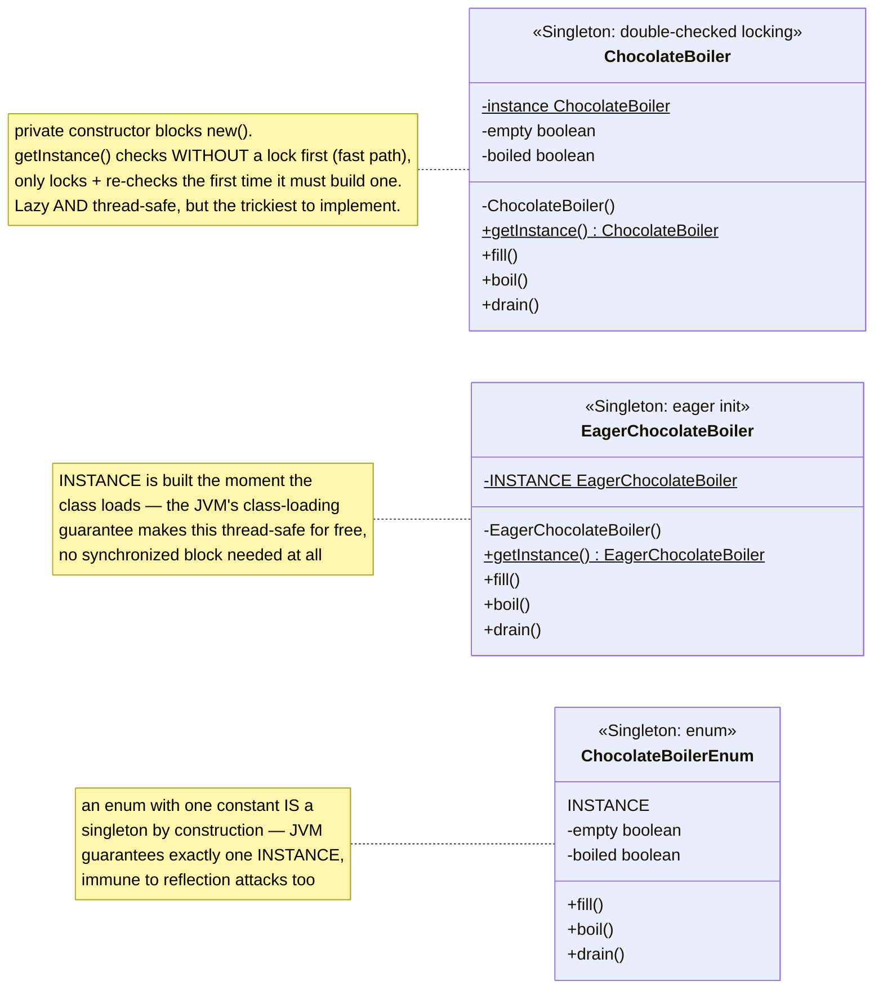
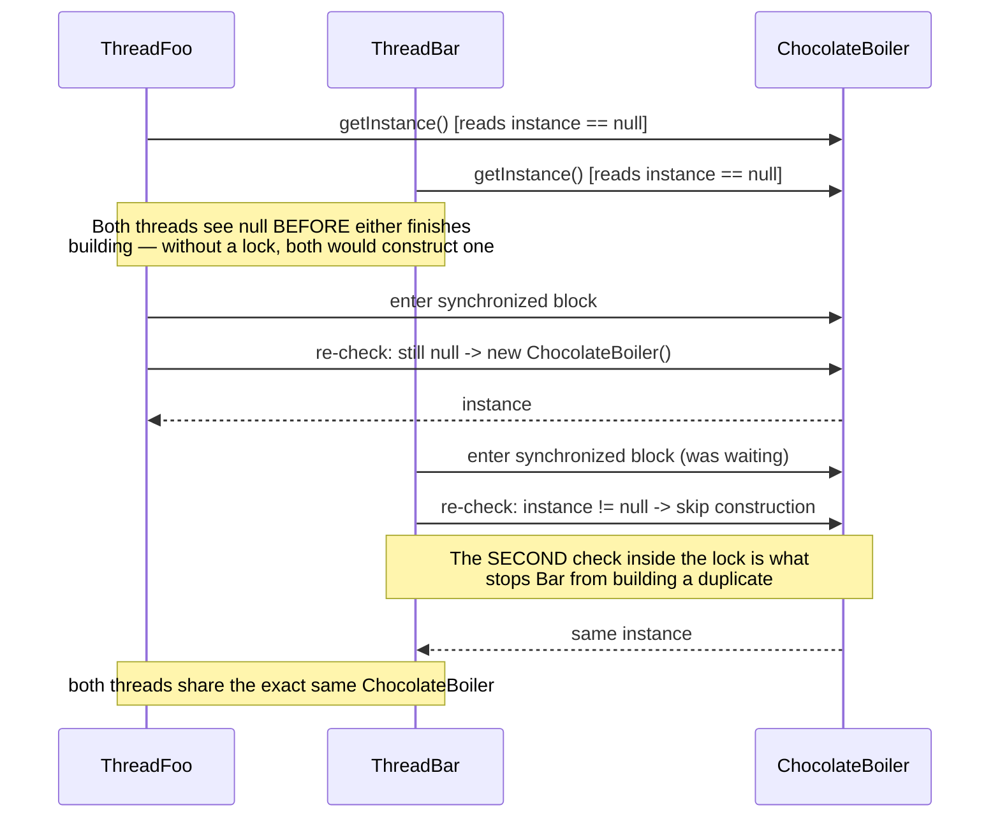

# Singleton Design Pattern

*Example: the Chocolate Boiler, from Head First Design Patterns.*

## What it is
Singleton ensures a class has only **one instance**, and provides a single
global point of access to it. Unlike the other creational patterns, it isn't
about hiding *which* class gets instantiated — it's about controlling *how many*
instances of one specific class can ever exist.

## Problem it solves
A candy factory has exactly one physical chocolate boiler. If two
`ChocolateBoiler` objects existed in the code, two independent pieces of logic
could each believe it's safe to `fill()` or `drain()` "the" boiler — but
there's only one tank, so that's a real-world data-integrity bug, not just an
abstract concern. Singleton solves this by making the constructor `private`
and forcing everyone through one static access method that always returns the
same instance.

## Participants (mapped to this package)

This package implements all three common variants side by side, so they can
be compared directly instead of just described.

| Variant                  | Singleton class          | Client / demo class    |
|---------------------------|----------------------------|---------------------------|
| Double-checked locking     | `ChocolateBoiler`          | `TestSingleton`            |
| Eager initialization       | `EagerChocolateBoiler`     | `TestEagerSingleton`       |
| Enum singleton             | `ChocolateBoilerEnum`      | `TestEnumSingleton`        |

- **Singleton (`ChocolateBoiler`)** — has a `private` constructor (so nothing
  outside the class can call `new ChocolateBoiler()`), a `private static volatile`
  field holding the one instance, and a `public static getInstance()` method
  that lazily creates the instance on first call and returns the same one on
  every subsequent call. `fill()`/`boil()`/`drain()` each guard against the
  boiler's current state, so calling them out of order is a harmless no-op.
- **Client (`TestSingleton`)** — never constructs a `ChocolateBoiler` directly;
  it only ever calls `ChocolateBoiler.getInstance()`. It spins up two threads
  that race to fetch the singleton concurrently, then compares what each
  thread got, to prove the implementation is thread-safe.

## Diagrams

*These two diagrams are meant to be readable on their own — every box is
labeled with its pattern role, and notes spell out what each one actually
does, so you shouldn't need the prose above to follow them.*

### UML class diagram (all three variants side by side)



**How to read this:** all three classes solve the exact same problem
(exactly one instance, reachable through one static access point) with three
different trade-offs. `ChocolateBoiler` is lazy but needs careful locking;
`EagerChocolateBoiler` is simplest but always builds the instance even if
unused; `ChocolateBoilerEnum` is the shortest and safest, at the cost of
losing constructor flexibility.

### Workflow (sequence diagram — two threads racing `getInstance()`)



## Why double-checked locking
A naive `getInstance()` (`if (instance == null) instance = new ChocolateBoiler();`
with no synchronization) is **not thread-safe** — two threads can both pass the
`null` check before either finishes constructing, producing two boilers.
Wrapping the whole method in `synchronized` fixes that but makes *every* call
pay a locking cost forever, even after the instance already exists. Double-checked
locking is the middle ground:

1. **First check (no lock)** — the fast path. Once the instance exists, every
   future call returns immediately without ever touching the `synchronized` block.
2. **Lock, then check again** — only taken the first few times, while the
   instance is still being built. The second check inside the lock stops a
   second thread (that also passed the first check before construction
   finished) from constructing a duplicate.
3. **`volatile`** — without it, one thread could see a reference to `instance`
   that points to memory the constructor hasn't finished writing into yet
   (an instruction-reordering hazard). `volatile` prevents that.

## Architecture / Flow

```
                      ChocolateBoiler
                      -----------------------------------
                      - static volatile instance : ChocolateBoiler
                      - empty : boolean
                      - boiled : boolean
                      - ChocolateBoiler()                <-- private constructor
                      + static getInstance() : ChocolateBoiler
                      + fill()   <-- only if empty
                      + boil()   <-- only if full and not yet boiled
                      + drain()  <-- only if full and boiled

Client code never does `new ChocolateBoiler()` — only ChocolateBoiler.getInstance()
```

### Step-by-step call flow (two threads racing for the instance)

```
ThreadFoo                                   ThreadBar
----------                                  ----------
ChocolateBoiler.getInstance()               ChocolateBoiler.getInstance()
   │                                            │
   ├─ read instance (null) ─────────────────────┤─ read instance (null)
   ├─ enter synchronized block                  ├─ blocked, waiting for lock
   ├─ re-check: still null → construct          │
   │     instance = new ChocolateBoiler()       │
   ├─ return instance                           ├─ lock acquired, re-check:
   │                                             │     instance != null now
   │                                             ├─ SKIPS construction
   │                                             └─ returns the SAME instance
   │
Both threads now hold a reference to the one ChocolateBoiler that was built.
"Same instance seen by both threads?" prints true.
```

Whichever thread wins the race to construct first "wins" — but the crucial
guarantee is that only one boiler is ever created, and every caller
(regardless of which thread) shares it.

Note: `getInstance()` itself is thread-safe, but `fill()`/`boil()`/`drain()`
are not synchronized against each other. That's intentional scope for this
example (it's demonstrating Singleton, not general concurrent-object design),
so `TestSingleton` runs the fill/boil/drain cycle single-threaded, after the
concurrency check on `getInstance()` completes.

## Variant: Eager Initialization (`EagerChocolateBoiler`)

```
EagerChocolateBoiler
--------------------------------------------
- static final INSTANCE = new EagerChocolateBoiler()   <-- built at class-load time
- EagerChocolateBoiler()                                <-- private constructor
+ static getInstance() : EagerChocolateBoiler
```

No `getInstance()` logic is needed at all — the JVM builds `INSTANCE` exactly
once, the moment the class is first loaded, and the class-loading mechanism
itself is thread-safe by spec. Every call to `getInstance()` just returns the
already-built field.

Trade-off: simplest and fully thread-safe with zero synchronization code, but
the boiler object is created even if the factory never actually uses it that run.

## Variant: Enum Singleton (`ChocolateBoilerEnum`)

```
ChocolateBoilerEnum (enum)
--------------------------------------------
INSTANCE                              <-- the one and only constant
- empty : boolean
- boiled : boolean
+ fill() / boil() / drain()
```

An enum with a single constant *is* a singleton — the JVM guarantees each enum
constant is instantiated exactly once, and this guarantee holds even under
concurrent class loading, so (like eager init) no explicit locking is needed.

Trade-off: the shortest, safest form — immune to the reflection and
deserialization attacks that can otherwise instantiate a second copy of a
private-constructor singleton — but you're committing to the enum's fixed
`INSTANCE` shape.

## Why this matters (the point of the pattern)
- Guarantees exactly one boiler exists for the lifetime of the application —
  no code can accidentally create a second one and desynchronize its
  empty/boiled state from the real physical tank.
- Provides one well-known global access point (`ChocolateBoiler.getInstance()`)
  instead of passing the instance around everywhere manually.
- The double-checked locking version specifically matters in multi-threaded
  code — without it, concurrent first-time callers can create more than one
  "singleton," silently breaking the guarantee.

## Variant comparison (quick recall)

| Variant                     | Class                  | How it works                                          | Trade-off |
|------------------------------|--------------------------|--------------------------------------------------------|-----------|
| Eager initialization          | `EagerChocolateBoiler`  | `private static final EagerChocolateBoiler INSTANCE = new EagerChocolateBoiler();` | Simplest and inherently thread-safe, but the instance is built at class-load time even if never used. |
| Double-checked locking         | `ChocolateBoiler`       | Lazy + synchronized only during first construction | Lazy AND thread-safe, but requires `volatile` and careful implementation. |
| Enum singleton                | `ChocolateBoilerEnum`   | `public enum ChocolateBoilerEnum { INSTANCE; }`         | Thread-safe, serialization-safe, and reflection-proof "for free," but less flexible (can't lazily pass constructor args). |

## Quick recall checklist
- [ ] Private constructor → blocks `new` from outside the class (all variants except enum, where the enum mechanism itself blocks external instantiation)
- [ ] Static instance field → holds the one shared instance (`volatile` if lazily built under concurrency, `final` if built eagerly)
- [ ] Static access method → the only way callers obtain the instance (`getInstance()`, or `INSTANCE` directly for the enum variant)
- [ ] Double-checked locking → check-without-lock (fast path) → lock → check-again-inside-lock (prevents duplicate construction) — needed only for lazy, non-enum singletons
- [ ] Eager & enum variants need no explicit locking — the JVM's class-loading guarantee does the thread-safety work for you
- [ ] Singleton-safe construction ≠ automatically thread-safe instance methods — `fill()`/`boil()`/`drain()` still need their own synchronization if called concurrently
