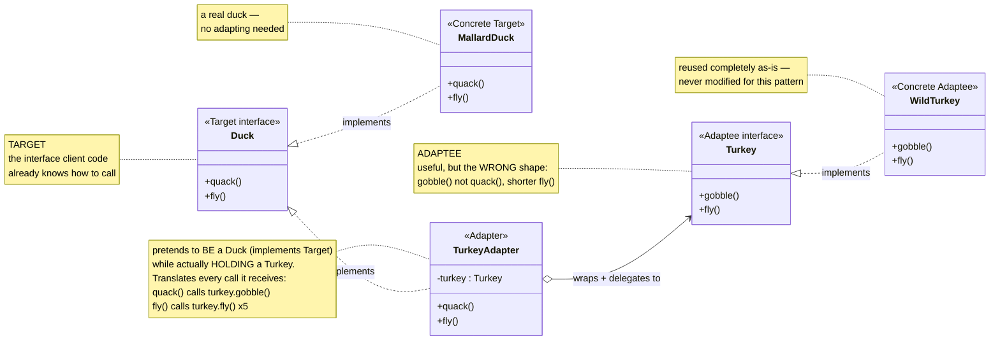
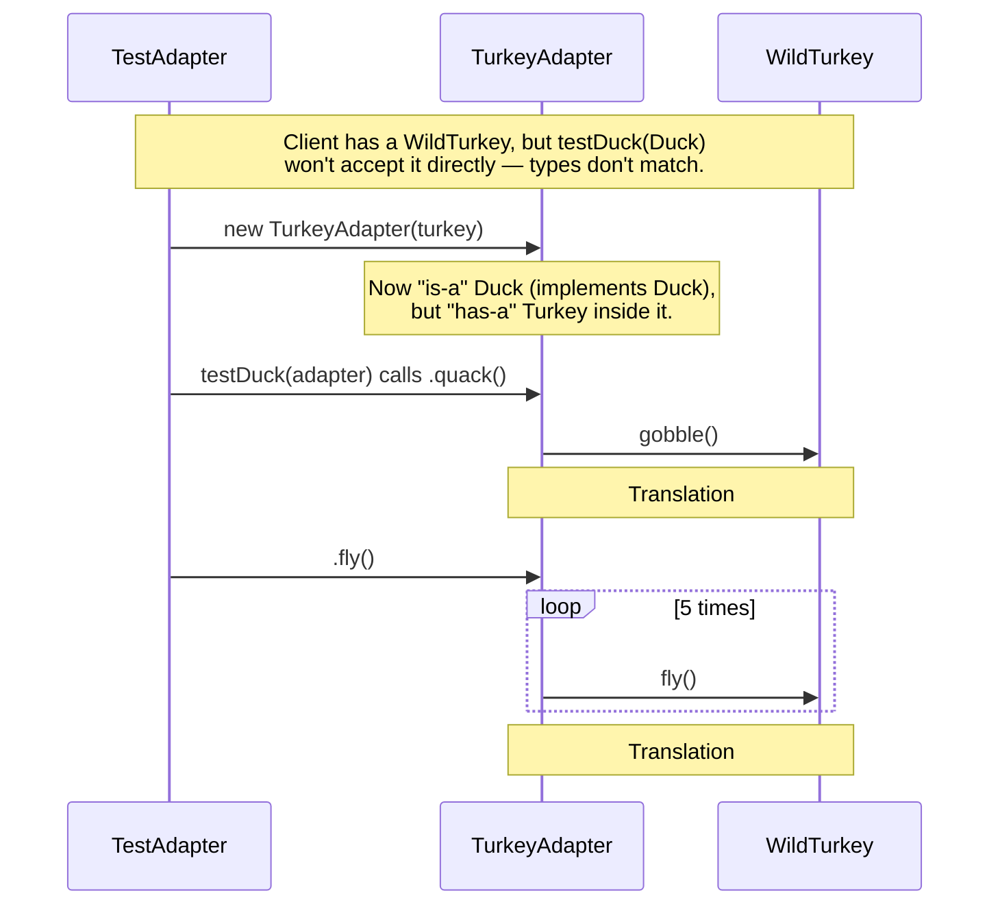

# Adapter Design Pattern

[← Not sure this is the right pattern? See the decision tree](../../../../PATTERN_DECISION_TREE.md) ·
[quick reference for all 23](../../../../PATTERN_DECISION_TREE.md#user-content-every-pattern-grouped-by-pattern)

*Example: the Duck/Turkey Adapter, from Head First Design Patterns.*

## What it is
Adapter lets objects with incompatible interfaces work together. It wraps one
object (the "adaptee") in a new object (the "adapter") that translates calls
into a form the client already understands — without modifying either the
client or the adaptee's original code.

## Problem it solves
Code written against `Duck` only knows `quack()` and `fly()`. `Turkey` is a
perfectly good interface, but it exposes `gobble()` instead of `quack()`, and
its `fly()` only covers a short hop — so `Duck`-consuming code simply can't
call `testDuck(wildTurkey)` directly; the types don't match. Adapter fixes
this without touching `Duck` or `Turkey` at all: it introduces a new class
that stands in for a `Duck`, but internally translates each call into the
equivalent `Turkey` behavior.

## Participants (mapped to this package)

| Role      | Type      | Class in this package |
|-----------|-----------|--------------------------|
| Target    | interface | `Duck`                   |
| Concrete Target | class | `MallardDuck`            |
| Adaptee   | interface | `Turkey`                  |
| Concrete Adaptee | class | `WildTurkey`             |
| Adapter   | class     | `TurkeyAdapter`           |

- **Target (`Duck`)** — the interface the client already knows how to use
  (`quack()`, `fly()`).
- **Concrete Target (`MallardDuck`)** — a real duck; no adapting needed.
- **Adaptee (`Turkey`)** — a useful interface with an incompatible shape
  (`gobble()` instead of `quack()`, and a shorter `fly()`). Never modified.
- **Concrete Adaptee (`WildTurkey`)** — a real, working turkey, reused as-is.
- **Adapter (`TurkeyAdapter`)** — `implements Duck` (so it satisfies whatever
  the client expects) while holding a `Turkey` internally and translating
  `quack()`/`fly()` calls into the wrapped turkey's `gobble()`/`fly()`.

This is the **object adapter** style — the adapter reaches the adaptee through
composition (a stored reference), not through inheriting from it. Because
`Duck` is an interface here (not a class, unlike a `RoundPeg`-style example),
`TurkeyAdapter` doesn't even need to work around single inheritance — it
simply implements `Duck` and composes over `Turkey`, which is the cleanest
form this pattern can take in Java.

## Diagrams

*These two diagrams are meant to be readable on their own — every box is
labeled with its pattern role, and notes spell out what each arrow actually
does, so you shouldn't need the prose above to follow them.*

### UML class diagram



**How to read this:** the left side (`Duck`, `MallardDuck`) is the shape the
client already speaks. The right side (`Turkey`, `WildTurkey`) is a
perfectly good class the client *can't* speak to directly. `TurkeyAdapter`
sits in the middle, facing both ways at once: it `implements Duck` (so
anyone expecting a `Duck` accepts it without complaint) and it *holds* a
`Turkey` (so it can forward the real work to something that already knows
how to do it).

### Workflow (sequence diagram)



## Architecture / Flow

```
        Client code (testDuck)                  Turkey (Adaptee)
        --------------------                     ---------------------
        void testDuck(Duck duck) {                + gobble()
            duck.quack();                          + fly()   [short hop]
            duck.fly();                                  ▲
        }                                                  │ wraps (composition)
                 │                                          │
                 │ works only with                          │
                 ▼                                          │
             Duck (Target, interface)                       │
        --------------------                                │
        + quack()                                            │
        + fly()                                              │
                 ▲            ▲                              │
                 │ implements  │ implements                   │
          MallardDuck    TurkeyAdapter ─────────────────────────┘
                         - turkey : Turkey
                         + quack() { turkey.gobble(); }
                         + fly()   { turkey.fly() x5; }
```

### Step-by-step call flow

1. `TestAdapter` has a `WildTurkey`, but `testDuck(Duck duck)` won't accept it
   directly — the types don't match.
2. It wraps the turkey: `new TurkeyAdapter(turkey)`. The adapter stores the
   `Turkey` reference internally.
3. `testDuck(turkeyAdapter)` compiles fine, because `TurkeyAdapter implements Duck`
   — from the client's point of view, it's just another `Duck`.
4. Inside `testDuck()`, `duck.quack()` is called on what the client believes
   is a plain `Duck`. Because the actual object is a `TurkeyAdapter`, this
   dispatches to its overridden `quack()`.
5. `TurkeyAdapter.quack()` delegates straight to `turkey.gobble()` — translating
   the adaptee's interface into the call the client made.
6. `duck.fly()` similarly dispatches to `TurkeyAdapter.fly()`, which calls the
   wrapped turkey's `fly()` five times in a row, since one turkey-flight is
   much shorter than one duck-flight — the adapter compensates for that
   difference so the client still gets duck-like flight behavior.

```
TestAdapter --> new TurkeyAdapter(wildTurkey)   [wraps the incompatible adaptee]
TestAdapter --> testDuck(turkeyAdapter)
testDuck(duck)
   ├──> duck.quack()                    [duck is actually a TurkeyAdapter]
   │        └──> TurkeyAdapter.quack()
   │                 └──> turkey.gobble()   [delegates to the wrapped WildTurkey]
   └──> duck.fly()
            └──> TurkeyAdapter.fly()
                     └──> turkey.fly() x5   [delegates 5 times to compensate]
```

## Why this matters (the point of the pattern)
- `Duck` and `Turkey` are both left completely untouched — the incompatibility
  is resolved entirely inside the new `TurkeyAdapter` class.
- The client (`testDuck`) is decoupled from the concrete type it's driving —
  it only ever depends on the `Duck` abstraction.
- New incompatible types can be supported later by writing one more adapter,
  without touching any existing class.

## Object Adapter vs. Class Adapter

| Aspect          | Object Adapter (this package)                    | Class Adapter                                    |
|------------------|----------------------------------------------------|----------------------------------------------------|
| Mechanism        | Adapter *holds* the adaptee (composition)           | Adapter *extends* both Target and Adaptee (multiple inheritance) |
| Java support     | Fully supported — the natural choice in Java        | Only possible here because `Duck` and `Turkey` are both interfaces — `TurkeyAdapter` could `implement` both, but it would then need to supply its own `fly()`/`gobble()` bodies directly instead of delegating, losing the "reuse the real WildTurkey" benefit |
| Flexibility      | Can adapt any implementation of the adaptee interface at runtime, since it holds a reference | Locked to whichever adaptee behavior gets hard-coded into the adapter class itself |

## Quick recall checklist
- [ ] Target → the interface the client already understands (`Duck`)
- [ ] Adaptee → the existing, incompatible interface being reused as-is (`Turkey`)
- [ ] Adapter → implements the Target, holds the Adaptee, translates calls between them (`TurkeyAdapter`)
- [ ] Client → only ever talks to the Target type, unaware an adapter is involved (`testDuck`)
