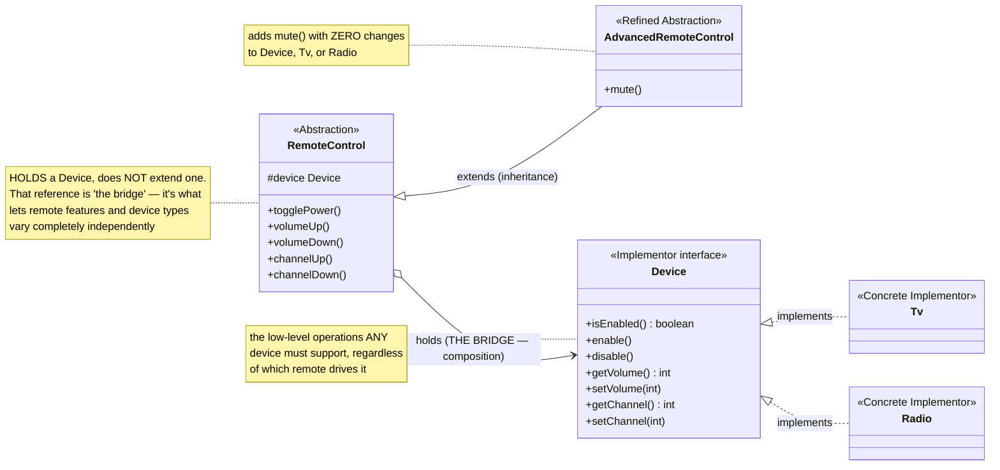
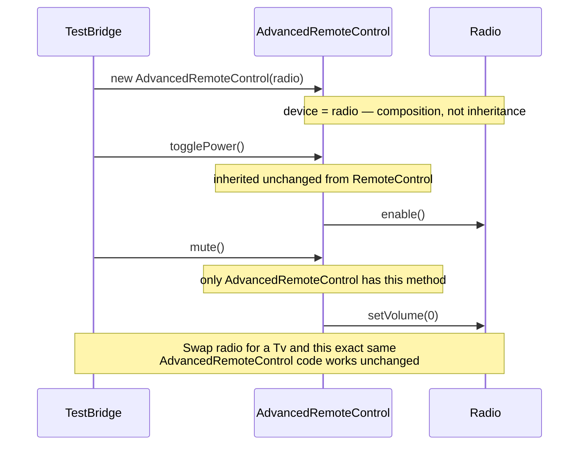

# Bridge Design Pattern

[← Not sure this is the right pattern? See the decision tree](../../../../PATTERN_DECISION_TREE.md)

*Example: a universal Remote Control, over a TV or Radio — a Head-First-style
example built for this repo. Head First Design Patterns only covers Bridge
briefly, in its "leftover patterns" chapter, without a fully worked example,
so this isn't a verbatim book example.*

## What it is
Bridge decouples an abstraction from its implementation so the two can vary
independently. Instead of one class hierarchy per combination
(`TvRemoteControl`, `TvAdvancedRemoteControl`, `RadioRemoteControl`,
`RadioAdvancedRemoteControl`, ...), you get two separate hierarchies — remotes
and devices — connected by a reference held inside the remote, not by inheritance.

## Problem it solves
A remote control needs to work with different devices (TV, Radio, ...), and
there might be different kinds of remotes (basic, advanced-with-mute, ...).
Modeling this purely with inheritance (`AdvancedTvRemoteControl extends TvRemoteControl`)
means every new device type or every new remote feature multiplies the number
of classes needed. Bridge fixes this by putting the device behind an
interface (`Device`) that the remote *holds*, not inherits from — any remote
subclass works with any device implementation, without a combinatorial
explosion of classes.

## Participants (mapped to this package)

| Role                   | Type      | Class in this package         |
|------------------------|-----------|----------------------------------|
| Abstraction             | class     | `RemoteControl`                  |
| Refined Abstraction     | class     | `AdvancedRemoteControl`           |
| Implementor             | interface | `Device`                          |
| Concrete Implementor    | class     | `Tv`, `Radio`                     |
| Client                  | class     | `TestBridge`                      |

- **Abstraction (`RemoteControl`)** — defines high-level operations
  (`togglePower()`, `volumeUp()`, `channelUp()`, ...) purely in terms of the
  `Device` interface. It *holds* a `Device`, it doesn't extend one.
- **Refined Abstraction (`AdvancedRemoteControl`)** — extends `RemoteControl`
  with an extra feature (`mute()`), without needing any change to `Device`,
  `Tv`, or `Radio`.
- **Implementor (`Device`)** — declares the low-level operations
  (`enable()`, `setVolume()`, `setChannel()`, ...) any controllable device
  must support.
- **Concrete Implementors (`Tv`, `Radio`)** — the actual devices, each
  implementing `Device` in their own way.
- **Client (`TestBridge`)** — freely mixes any remote with any device:
  a basic `RemoteControl` driving a `Tv`, and an `AdvancedRemoteControl`
  driving a `Radio`.

## Diagrams

*These two diagrams are meant to be readable on their own — every box is
labeled with its pattern role, and notes spell out what each one actually
does, so you shouldn't need the prose above to follow them.*

### UML class diagram



**How to read this:** there are two separate, independently-growing
hierarchies here — remotes (top) and devices (bottom) — connected by exactly
one arrow: the `device` field inside `RemoteControl`. That's the bridge.
Notice `AdvancedRemoteControl` only extends *upward* (more remote features);
it never touches `Device` at all. A new device type or a new remote feature
each require changes on only one side.

### Workflow (sequence diagram)



## Architecture / Flow

```
        RemoteControl (Abstraction)              Device (Implementor, interface)
        ---------------------------              -----------------------------------
        # device : Device        ─────bridge────▶  + enable() / disable()
        + togglePower()                             + getVolume() / setVolume(int)
        + volumeUp() / volumeDown()                 + getChannel() / setChannel(int)
        + channelUp() / channelDown()                       ▲              ▲
               ▲                                            │              │
               │ extends                                   Tv            Radio
        AdvancedRemoteControl
        + mute()   { device.setVolume(0); }
```

The key difference from a typical Component/Product hierarchy: the arrow
between `RemoteControl` and `Device` is composition ("has-a", the bridge),
while the arrow from `RemoteControl` to `AdvancedRemoteControl` is
inheritance. Both hierarchies are free to grow independently — a new
`Device` (e.g. `SoundSystem`) needs no changes to `RemoteControl` or
`AdvancedRemoteControl`, and a new remote feature needs no changes to `Device`.

### Step-by-step call flow (`AdvancedRemoteControl` + `Radio`)

1. `new AdvancedRemoteControl(radio)` stores the `Radio` instance as a plain
   `Device` reference (inherited field `device` from `RemoteControl`).
2. `advancedRemote.togglePower()` — this method is inherited unchanged from
   `RemoteControl`; it calls `device.isEnabled()`/`device.enable()`, dispatched
   to `Radio`'s implementation.
3. `advancedRemote.mute()` — defined only on `AdvancedRemoteControl`; it calls
   `device.setVolume(0)`, again dispatched to `Radio.setVolume(...)`.

```
new AdvancedRemoteControl(radio)
   └──> device = radio   [bridge: composition, not inheritance]

advancedRemote.togglePower()          [inherited from RemoteControl]
   └──> device.enable()                [dispatched to Radio.enable()]

advancedRemote.mute()                 [only on AdvancedRemoteControl]
   └──> device.setVolume(0)            [dispatched to Radio.setVolume()]
```

Swap `radio` for `tv` and the exact same `AdvancedRemoteControl` code works
unchanged — the bridge is what makes that swap trivial.

## Why this matters (the point of the pattern)
- Avoids the class explosion that pure inheritance would cause when both the
  abstraction (remote features) and implementation (device types) can vary.
- New devices and new remote features can each be added independently —
  neither hierarchy needs to know about changes in the other.
- The abstraction's code (`RemoteControl`) depends only on the `Device`
  interface, never a concrete device — classic Dependency Inversion.

## Quick recall checklist
- [ ] Abstraction → defines high-level operations, holds (not extends) an Implementor (`RemoteControl`)
- [ ] Refined Abstraction → extends the Abstraction with more features, still device-agnostic (`AdvancedRemoteControl`)
- [ ] Implementor → the low-level interface the Abstraction delegates to (`Device`)
- [ ] Concrete Implementor → the actual low-level implementation (`Tv`, `Radio`)
- [ ] The "bridge" itself → the `device` field, a composition link connecting two independently-varying hierarchies
