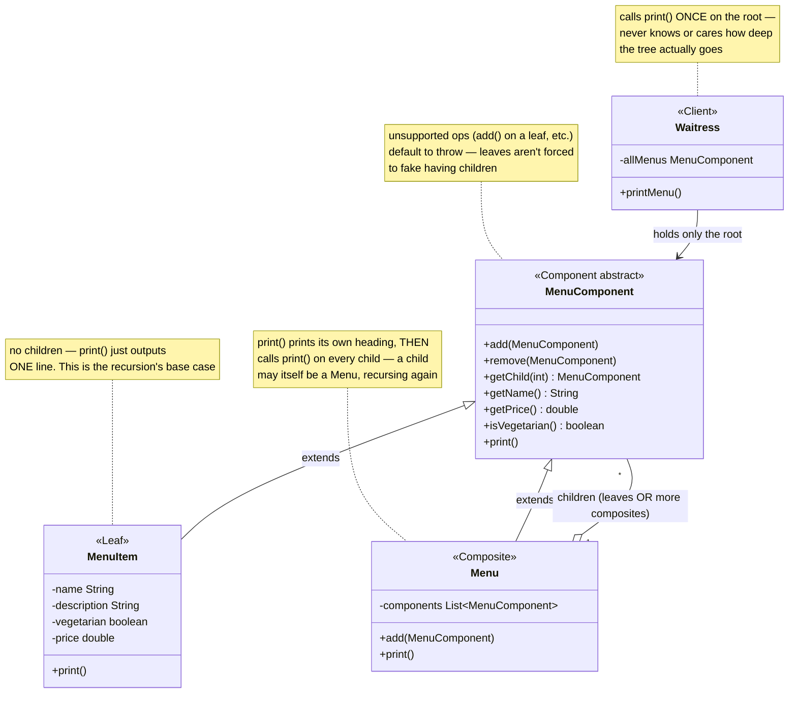
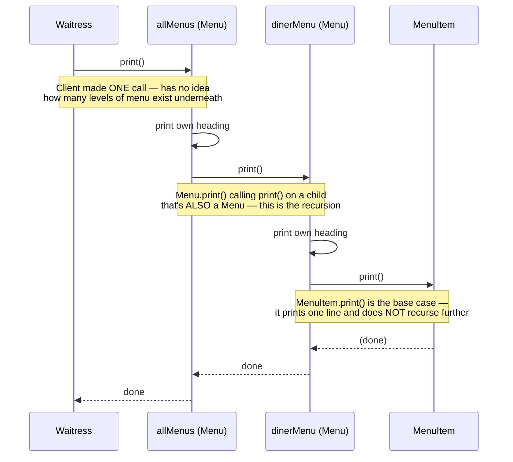

# Composite Design Pattern

[← Not sure this is the right pattern? See the decision tree](../../../../PATTERN_DECISION_TREE.md) ·
[quick reference for all 23](../../../../PATTERN_DECISION_TREE.md#every-pattern-grouped-by-pattern)

*Example: the Diner Menu tree, from Head First Design Patterns.*

## What it is
Composite lets you compose objects into tree structures to represent
part-whole hierarchies. It lets clients treat individual objects (leaves)
and compositions of objects (branches) uniformly — the same method call
works whether you're pointing at one dish or an entire menu of sub-menus.

## Problem it solves
A restaurant's menu isn't flat: the "All Menus" menu contains a breakfast
menu and a diner menu; the diner menu contains individual dishes *and* a
whole dessert sub-menu. Without Composite, printing this means writing
separate code for "print an item" vs. "print a menu of items" vs. "print a
menu that itself contains another menu" — and that code gets more tangled
the deeper the nesting goes. Composite solves this by giving leaves
(`MenuItem`) and branches (`Menu`) the same `print()` method: a branch's
`print()` just prints itself, then recursively calls `print()` on each
child — leaf or branch, it doesn't matter.

## Participants (mapped to this package)

| Role                | Type            | Class in this package                          |
|---------------------|-----------------|--------------------------------------------------|
| Component             | abstract class  | `MenuComponent`                                   |
| Leaf                  | class           | `MenuItem`                                        |
| Composite             | class           | `Menu`                                            |
| Client                | class           | `Waitress` (used by `TestComposite`)              |

- **Component (`MenuComponent`)** — declares every operation both leaves and
  composites might support (`add`, `remove`, `getChild`, `getName`,
  `getPrice`, `print`, ...). Operations that don't make sense for a given
  subclass (e.g. `add()` on a `MenuItem`) default to throwing
  `UnsupportedOperationException`, so leaves aren't forced to fake a child list.
- **Leaf (`MenuItem`)** — a single dish. Has no children; only implements the
  "data" getters and a `print()` that outputs one line — the recursion's base case.
- **Composite (`Menu`)** — holds a `List<MenuComponent>` of children (which may
  be more `MenuItem` leaves *or* further nested `Menu` composites) and
  implements `print()` by printing its own heading, then looping over every
  child and calling `print()` on each.
- **Client (`Waitress`)** — holds a reference to just the single top-level
  `MenuComponent` and calls `print()` once — it never needs to know how deep
  the tree actually goes.

## Diagrams

*These two diagrams are meant to be readable on their own — every box is
labeled with its pattern role, and notes spell out what each one actually
does, so you shouldn't need the prose above to follow them.*

### UML class diagram



**How to read this:** `Menu`'s children list can hold `MenuItem` leaves *or*
more `Menu` composites — that self-reference (`Menu` containing
`MenuComponent`, which `Menu` itself extends) is what lets the tree nest to
any depth. `Waitress` never branches on "is this a leaf or a menu?" — it just
calls `print()` and the recursion inside `Menu` handles the rest.

### Workflow (sequence diagram)



## Architecture / Flow

```
                    MenuComponent (Component, abstract)
                    -------------------------------------
                    + add(MenuComponent)      <-- composite-only, throws by default
                    + getChild(int)           <-- composite-only, throws by default
                    + getName() / getPrice() / isVegetarian()
                    + print()                 <-- abstract behavior, overridden by both
                       ▲                                    ▲
                       │ extends                             │ extends
                    MenuItem (Leaf)                        Menu (Composite)
                    - name, description,                   - menuComponents: List<MenuComponent>
                      vegetarian, price                     print() {
                    print() {                                  print own heading
                       print one line                          for each child: child.print()  <-- recursion
                    }                                       }
```

### Tree shape used in the demo

```
All Menus
 ├── Pancake House Menu
 │     ├── K&B's Pancake Breakfast   (MenuItem)
 │     └── Waffles                   (MenuItem)
 └── Diner Menu
       ├── Vegetarian BLT            (MenuItem)
       ├── BLT                       (MenuItem)
       └── Dessert Menu              (Menu, nested 2 levels deep)
             └── Apple Pie           (MenuItem)
```

### Step-by-step call flow (`waitress.printMenu()`)

1. `Waitress` only holds `allMenus`, the root `Menu`. It calls
   `allMenus.print()` — one single call, regardless of tree depth.
2. `Menu.print()` (on `allMenus`) prints its own heading, then loops over its
   children: `pancakeHouseMenu` and `dinerMenu`, calling `print()` on each.
3. `pancakeHouseMenu.print()` runs the exact same `Menu.print()` code —
   prints its heading, then loops over its own children, which happen to be
   `MenuItem` leaves this time, calling `print()` on each.
4. `MenuItem.print()` is the base case — it just prints one line and returns,
   no further recursion.
5. Back in `dinerMenu.print()`, one of its children is itself a `Menu`
   (`dessertMenu`) — so calling `print()` on it recurses into `Menu.print()`
   again, one level deeper.

```
waitress.printMenu()
   └──> allMenus.print()                         [Menu.print()]
            ├──> pancakeHouseMenu.print()         [Menu.print() again — one level down]
            │        ├──> item.print()            [MenuItem.print() — base case]
            │        └──> item.print()
            └──> dinerMenu.print()                [Menu.print() again]
                     ├──> item.print()
                     ├──> item.print()
                     └──> dessertMenu.print()      [Menu.print() again — TWO levels down]
                              └──> item.print()
```

Every `print()` call site looks identical — `component.print()` — whether
`component` is a leaf or a composite, and whether it's one level deep or four.

## Why this matters (the point of the pattern)
- The client (`Waitress`) treats the entire tree as one object — it never
  branches its own logic based on "is this a leaf or a menu?"
- New nesting can be added (another sub-menu, another level deep) with zero
  changes to `Waitress` or `MenuComponent` — the same recursive `print()`
  handles any depth.
- Leaves and composites share one interface, so code written against
  `MenuComponent` automatically works for both.

## Quick recall checklist
- [ ] Component (abstract) → the shared interface for leaves and composites, with unsupported ops defaulting to throw (`MenuComponent`)
- [ ] Leaf → no children, implements only the "data" operations (`MenuItem`)
- [ ] Composite → holds a list of Components (leaves or more composites), recurses into each in `print()` (`Menu`)
- [ ] Client → holds only the root Component, calls one method, the recursion does the rest (`Waitress`)
