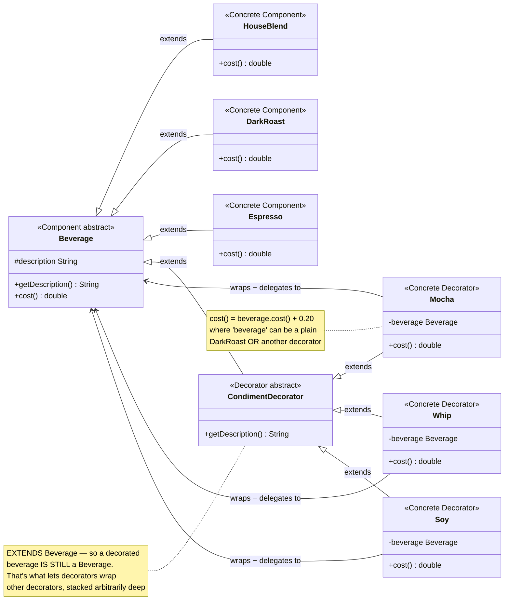
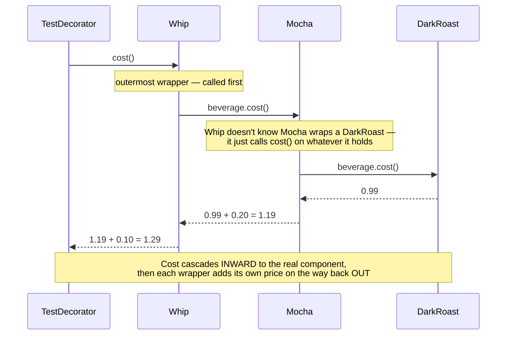

# Decorator Design Pattern

[← Not sure this is the right pattern? See the decision tree](../../../../PATTERN_DECISION_TREE.md)

*Example: Starbuzz Coffee, from Head First Design Patterns.*

## What it is
Decorator attaches additional responsibilities to an object dynamically.
Decorators provide a flexible alternative to subclassing for extending
behavior — instead of a `DarkRoastWithMochaAndWhip` subclass, you wrap a plain
`DarkRoast` in a `Mocha` decorator, then wrap *that* in a `Whip` decorator.

## Problem it solves
A coffee shop sells drinks with any combination of condiments (mocha, whip,
soy...), each adding its own cost. Subclassing every combination
(`DarkRoastWithMocha`, `DarkRoastWithMochaAndWhip`, `HouseBlendWithSoy`, ...)
explodes combinatorially. Decorator solves this by making each condiment a
wrapper that adds its cost/description on top of whatever it wraps — and
since the wrapper is itself a `Beverage`, wrappers can stack on each other
indefinitely.

## Participants (mapped to this package)

| Role                | Type            | Class in this package                          |
|----------------------|-----------------|--------------------------------------------------|
| Component             | abstract class  | `Beverage`                                       |
| Concrete Component    | class           | `HouseBlend`, `DarkRoast`, `Espresso`             |
| Decorator (abstract)  | abstract class  | `CondimentDecorator`                              |
| Concrete Decorator    | class           | `Mocha`, `Whip`, `Soy`                            |
| Client                | class           | `TestDecorator`                                   |

- **Component (`Beverage`)** — the common type for both plain and decorated
  drinks: `getDescription()`, `cost()`.
- **Concrete Components (`HouseBlend`, `DarkRoast`, `Espresso`)** — the actual
  drinks a customer starts an order with.
- **Decorator (`CondimentDecorator`)** — `extends Beverage`, so a decorated
  beverage is still a `Beverage` — this is what makes stacking decorators
  possible.
- **Concrete Decorators (`Mocha`, `Whip`, `Soy`)** — each holds a wrapped
  `Beverage`, and both delegates to it *and* adds its own cost/description on top.
- **Client (`TestDecorator`)** — wraps a base beverage in as many decorators
  as the order needs, then calls `cost()`/`getDescription()` on the outermost one.

## Diagrams

*These two diagrams are meant to be readable on their own — every box is
labeled with its pattern role, and notes spell out what each one actually
does, so you shouldn't need the prose above to follow them.*

### UML class diagram



**How to read this:** `CondimentDecorator` extending `Beverage` is the whole
trick — it means `Mocha`, `Whip`, and `Soy` are themselves `Beverage`s, so one
decorator's `beverage` field can point at a plain component *or* at another
decorator. Wrapping `Whip(Mocha(DarkRoast))` builds a 3-deep chain purely
through that self-referencing structure, with zero special-casing.

### Workflow (sequence diagram — `Whip(Mocha(DarkRoast)).cost()`)



## Architecture / Flow

```
                    Beverage (Component, abstract)
                    ------------------------------
                    + getDescription()
                    + cost()
                       ▲                    ▲
                       │ extends            │ extends
        ┌──────────────┴──────┐    CondimentDecorator (abstract Decorator)
        │      │              │    ------------------------------
   HouseBlend DarkRoast   Espresso  + getDescription()  (abstract, overridden)
                                         ▲
                                         │ extends
                          ┌──────────────┼──────────────┐
                          │              │               │
                        Mocha           Whip            Soy
                     - beverage      - beverage       - beverage
                     cost() = beverage.cost() + 0.20   (+0.10)   (+0.15)
```

### Step-by-step call flow (Dark Roast + Mocha + Mocha + Whip)

1. `Beverage darkRoast = new DarkRoast();` — a plain component, cost `0.99`.
2. `darkRoast = new Mocha(darkRoast);` — wraps it: now `darkRoast` refers to a
   `Mocha` holding the original `DarkRoast` inside.
3. `darkRoast = new Mocha(darkRoast);` — wraps *that* `Mocha` in another
   `Mocha`. The object graph is now `Mocha(Mocha(DarkRoast))`.
4. `darkRoast = new Whip(darkRoast);` — wraps again: `Whip(Mocha(Mocha(DarkRoast)))`.
5. Calling `darkRoast.cost()` on the outermost `Whip` cascades inward:

```
Whip.cost()
   └──> beverage.cost()          [beverage is the inner Mocha]
            Mocha.cost()
               └──> beverage.cost()   [beverage is the inner Mocha]
                        Mocha.cost()
                           └──> beverage.cost()   [beverage is the DarkRoast]
                                    DarkRoast.cost() = 0.99
                        <── returns 0.99 + 0.20 = 1.19
               <── returns 1.19 + 0.20 = 1.39
   <── returns 1.39 + 0.10 = 1.49
```

`getDescription()` cascades the same way, but builds a string outward-in
instead of summing a number: `"Dark Roast Coffee, Mocha, Mocha, Whip"`.

## Why this matters (the point of the pattern)
- New condiments can be added by writing one more `CondimentDecorator`
  subclass — no existing `Beverage` class ever needs to change (Open/Closed
  Principle).
- Any combination of condiments, in any order, in any quantity, is possible
  without a combinatorial explosion of subclasses.
- The client only ever sees a `Beverage` — it doesn't need to know how many
  layers of decoration are wrapped around the one it's holding.

## Quick recall checklist
- [ ] Component (abstract) → the shared type both plain and decorated objects implement (`Beverage`)
- [ ] Concrete Component → the object being decorated (`HouseBlend`, `DarkRoast`, `Espresso`)
- [ ] Decorator (abstract) → extends/implements the Component so it can BE one (`CondimentDecorator`)
- [ ] Concrete Decorator → holds a wrapped Component, delegates to it, adds its own behavior on top (`Mocha`, `Whip`, `Soy`)
- [ ] Client → wraps as many decorators as needed, then treats the result as one Component
