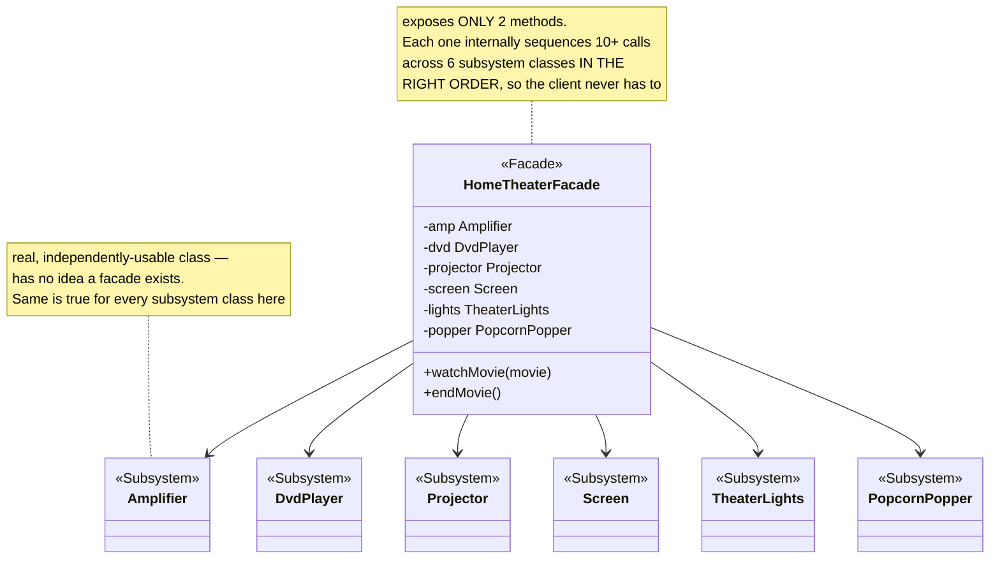
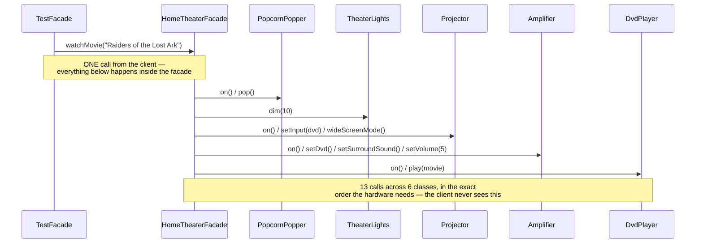

# Facade Design Pattern

*Example: the Home Theater, from Head First Design Patterns.*

## What it is
Facade provides a unified, simplified interface to a set of interfaces in a
subsystem. It defines a higher-level interface that makes the subsystem
easier to use — without hiding or removing access to the subsystem classes
themselves, for callers who still need finer control.

## Problem it solves
Watching a movie on a home theater setup means: turn on the popcorn popper,
dim the lights, lower the screen, turn on the projector and set it to
widescreen, turn on the amp and set surround sound and volume, turn on the
DVD player and press play — in the right order, every time. Making the client
do all of that directly means it has to know about, and correctly sequence,
six different classes. Facade wraps all of it behind one `watchMovie()` call.

## Participants (mapped to this package)

| Role                | Type  | Class in this package                                                       |
|---------------------|-------|--------------------------------------------------------------------------------|
| Facade               | class | `HomeTheaterFacade`                                                             |
| Subsystem classes    | class | `Amplifier`, `DvdPlayer`, `Projector`, `Screen`, `TheaterLights`, `PopcornPopper` |
| Client               | class | `TestFacade`                                                                    |

- **Subsystem classes** — each is a real, independently usable component with
  its own multi-step API (`amp.on()`, `amp.setSurroundSound()`,
  `amp.setVolume(5)`, ...). None of them know a facade exists.
- **Facade (`HomeTheaterFacade`)** — holds a reference to every subsystem
  component and exposes exactly two high-level operations, `watchMovie(movie)`
  and `endMovie()`, each of which drives the subsystem through the correct
  sequence of calls.
- **Client (`TestFacade`)** — builds the subsystem components once, wraps them
  in the facade, then only ever calls the facade's two methods.

## Diagrams

*These two diagrams are meant to be readable on their own — every box is
labeled with its pattern role, and notes spell out what each one actually
does, so you shouldn't need the prose above to follow them.*

### UML class diagram



**How to read this:** the arrows all point one way, from the facade down to
the subsystem — none of the subsystem classes point back. That's the whole
pattern: `HomeTheaterFacade` depends on all six of them, but they depend on
nothing. A caller who needs finer control can still skip the facade and call
`Amplifier`/`Projector`/etc. directly; the facade just adds a simpler path on top.

### Workflow (sequence diagram)



## Architecture / Flow

```
                          Client (TestFacade)
                                  │
                                  │ calls just 2 methods
                                  ▼
                       HomeTheaterFacade
                    -------------------------------
                    + watchMovie(String movie)
                    + endMovie()
                                  │
              ┌───────┬──────────┼──────────┬────────┬─────────┐
              ▼       ▼          ▼          ▼        ▼         ▼
          Amplifier DvdPlayer Projector   Screen  TheaterLights PopcornPopper
          (each a real, independently-usable subsystem class)
```

### Step-by-step call flow (`watchMovie(...)`)

1. `TestFacade` builds all six subsystem components and passes them into
   `new HomeTheaterFacade(...)`.
2. `homeTheater.watchMovie("Raiders of the Lost Ark")` is the *only* call the
   client makes to start the experience.
3. Inside it, the facade calls, in the exact order the hardware needs:
   `popper.on()` → `popper.pop()` → `lights.dim(10)` → `screen.down()` →
   `projector.on()` → `projector.setInput(dvd)` → `projector.wideScreenMode()` →
   `amp.on()` → `amp.setDvd(dvd)` → `amp.setSurroundSound()` →
   `amp.setVolume(5)` → `dvd.on()` → `dvd.play(movie)`.
4. The client never had to know this order, or that it even mattered.

```
TestFacade --> homeTheater.watchMovie("Raiders of the Lost Ark")
HomeTheaterFacade.watchMovie(movie)
   ├──> popper.on()          ├──> projector.on()
   ├──> popper.pop()         ├──> projector.setInput(dvd)
   ├──> lights.dim(10)       ├──> projector.wideScreenMode()
   ├──> screen.down()        ├──> amp.on() / setDvd / setSurroundSound / setVolume
   │                         └──> dvd.on() / dvd.play(movie)
   (13 calls across 6 classes, sequenced correctly, behind one method)
```

`endMovie()` does the same thing in reverse, shutting each component down in
the correct order.

## Why this matters (the point of the pattern)
- The client's code shrinks from a dozen+ ordered calls across six classes to
  two calls on one object.
- The subsystem classes are completely unchanged and still usable directly —
  Facade adds a simpler path, it doesn't remove the detailed one.
- If the correct startup/shutdown sequence ever changes (e.g. a new
  component is added), only `HomeTheaterFacade` needs updating — every
  caller of `watchMovie()`/`endMovie()` is unaffected.
- This is fundamentally about **loose coupling**: the client depends on one
  simple facade instead of six subsystem classes and their interaction rules.

## Quick recall checklist
- [ ] Facade → one simplified entry point over a subsystem (`HomeTheaterFacade`)
- [ ] Subsystem classes → real, independently usable components, unaware of the facade (`Amplifier`, `DvdPlayer`, etc.)
- [ ] Facade doesn't hide the subsystem → clients who need fine control can still use `Amplifier`/`DvdPlayer`/etc. directly
- [ ] Client → depends on the facade for the common case, not on every subsystem class and their call order
