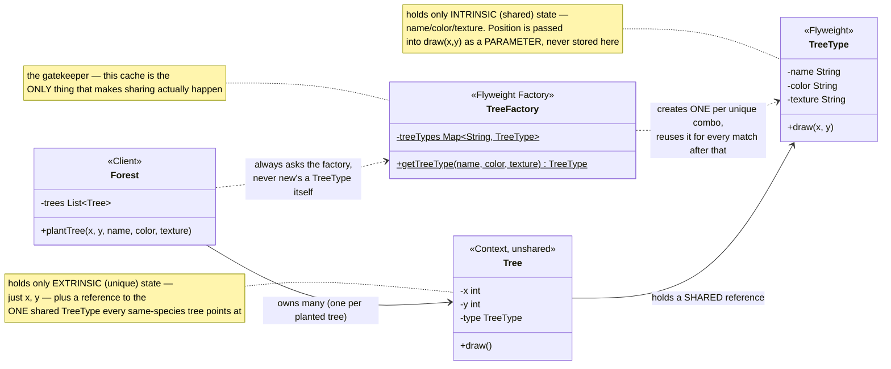
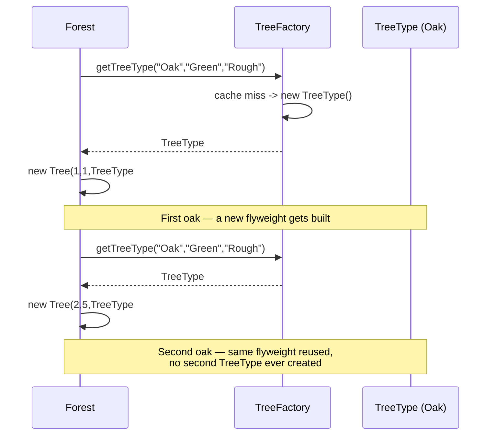

# Flyweight Design Pattern

[← Not sure this is the right pattern? See the decision tree](../../../../PATTERN_DECISION_TREE.md) ·
[quick reference for all 23](../../../../PATTERN_DECISION_TREE.md#user-content-every-pattern-grouped-by-pattern)

*Example: a forest of trees — a Head-First-style example built for this
repo. Head First Design Patterns only covers Flyweight briefly, in its
"leftover patterns" chapter, without a fully worked example, so this isn't a
verbatim book example.*

## What it is
Flyweight uses sharing to support large numbers of fine-grained objects
efficiently. It splits an object's state into **intrinsic** state (shared,
identical across many instances) and **extrinsic** state (unique per
instance, passed in from the outside instead of stored on the shared object).

## Problem it solves
A forest might have a million trees, but realistically only a handful of tree
*species* (oak, pine, ...). If every `Tree` object stored its own copy of the
species name, color, and texture, that's a huge amount of duplicated,
identical data multiplied by a million. Flyweight splits this: the
species/color/texture (intrinsic, shared) lives in one `TreeType` object per
unique combination, while each `Tree` only stores what's actually unique to
it — its `x`/`y` position (extrinsic) — plus a reference to the shared type.

## Participants (mapped to this package)

| Role                | Type  | Class in this package |
|---------------------|-------|--------------------------|
| Flyweight            | class | `TreeType`                |
| Flyweight Factory    | class | `TreeFactory`              |
| Context (unshared)   | class | `Tree`                     |
| Client               | class | `Forest` (used by `TestFlyweight`) |

- **Flyweight (`TreeType`)** — holds only intrinsic state (`name`, `color`,
  `texture`) and a `draw(x, y)` method that takes the position as a parameter
  instead of storing it — that's what makes one `TreeType` reusable across
  any number of trees at different positions.
- **Flyweight Factory (`TreeFactory`)** — the gatekeeper: `getTreeType(...)`
  returns an existing `TreeType` if one already exists for that combination,
  and only constructs a new one the first time a combination is seen. This is
  the mechanism that actually enforces sharing.
- **Context (`Tree`)** — the unshared, per-instance object: stores just `x`,
  `y`, and a reference to its shared `TreeType`.
- **Client (`Forest`)** — plants trees only via `TreeFactory.getTreeType(...)`,
  never by constructing a `TreeType` directly.

## Diagrams

*These two diagrams are meant to be readable on their own — every box is
labeled with its pattern role, and notes spell out what each one actually
does, so you shouldn't need the prose above to follow them.*

### UML class diagram



**How to read this:** thousands of `Tree` objects can exist, but they all
point at a tiny number of shared `TreeType` objects — one per unique
species/color/texture combination, guaranteed by `TreeFactory`'s cache. Split
your attention between the "many" side (`Forest` → many `Tree`s) and the
"few, shared" side (`Tree` → one `TreeType`, reused).

### Workflow (sequence diagram)



## Architecture / Flow

```
                    TreeFactory (Flyweight Factory)
                    ---------------------------------
                    - treeTypes : Map<String, TreeType>
                    + getTreeType(name, color, texture) : TreeType
                          │ returns existing, or creates + caches new
                          ▼
                    TreeType (Flyweight)          Tree (Context, unshared)
                    ---------------------------   ---------------------------
                    - name, color, texture         - x, y
                      (intrinsic — shared)          - type : TreeType (shared ref)
                    + draw(x, y)                   + draw() { type.draw(x, y); }
                                                          ▲
                                                          │ many Trees, few TreeTypes
                                                       Forest
                                                    - trees : List<Tree>
```

### Step-by-step call flow (planting 5 trees, 2 species)

1. `forest.plantTree(1, 1, "Oak", "Green", "Rough")` calls
   `TreeFactory.getTreeType("Oak", "Green", "Rough")`. No `TreeType` exists
   for that key yet, so one is created and cached.
2. `forest.plantTree(2, 5, "Oak", "Green", "Rough")` calls the factory again
   with the *same* combination — this time it's found in the cache and
   returned directly, no new `TreeType` created.
3. This repeats for a third oak and two pines (one new `TreeType` for pine).
4. Despite planting 5 `Tree` instances, only 2 `TreeType` flyweights ever
   exist — every oak `Tree` shares the exact same `TreeType` object, and
   likewise for pine.

```
plantTree(1,1,"Oak",...) --> TreeFactory.getTreeType(...) --> creates TreeType#1 (Oak)
plantTree(2,5,"Oak",...) --> TreeFactory.getTreeType(...) --> returns TreeType#1 (cached, same instance)
plantTree(7,3,"Oak",...) --> TreeFactory.getTreeType(...) --> returns TreeType#1 (cached, same instance)
plantTree(4,8,"Pine",...) --> TreeFactory.getTreeType(...) --> creates TreeType#2 (Pine)
plantTree(9,2,"Pine",...) --> TreeFactory.getTreeType(...) --> returns TreeType#2 (cached, same instance)

5 Tree objects created, only 2 TreeType objects created
```

## Why this matters (the point of the pattern)
- Memory scales with the number of *unique* combinations of shared state, not
  the number of *instances* — 5 trees or 5 million, still only 2 `TreeType`s
  here.
- The factory (`TreeFactory`) is what makes sharing actually happen — without
  it, nothing stops code from constructing a fresh `TreeType` every time.
- Extrinsic state (position) is always passed as a parameter, never stored on
  the flyweight — a flyweight that started caching per-instance state would
  stop being safely shareable.

## Quick recall checklist
- [ ] Flyweight → holds only shared (intrinsic) state; takes unique (extrinsic) state as method parameters (`TreeType`)
- [ ] Flyweight Factory → the only place flyweights get created, enforces reuse via a cache (`TreeFactory`)
- [ ] Context/unshared object → holds the extrinsic state plus a reference to its shared flyweight (`Tree`)
- [ ] Client → always goes through the factory, never constructs a flyweight directly (`Forest`)
