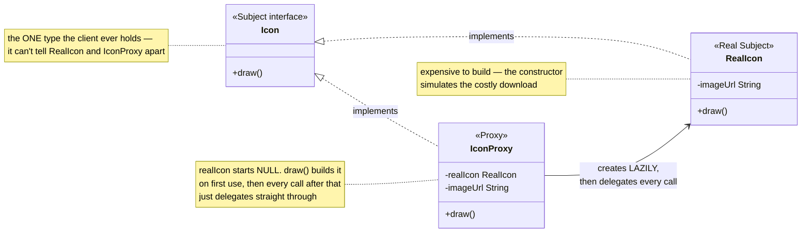
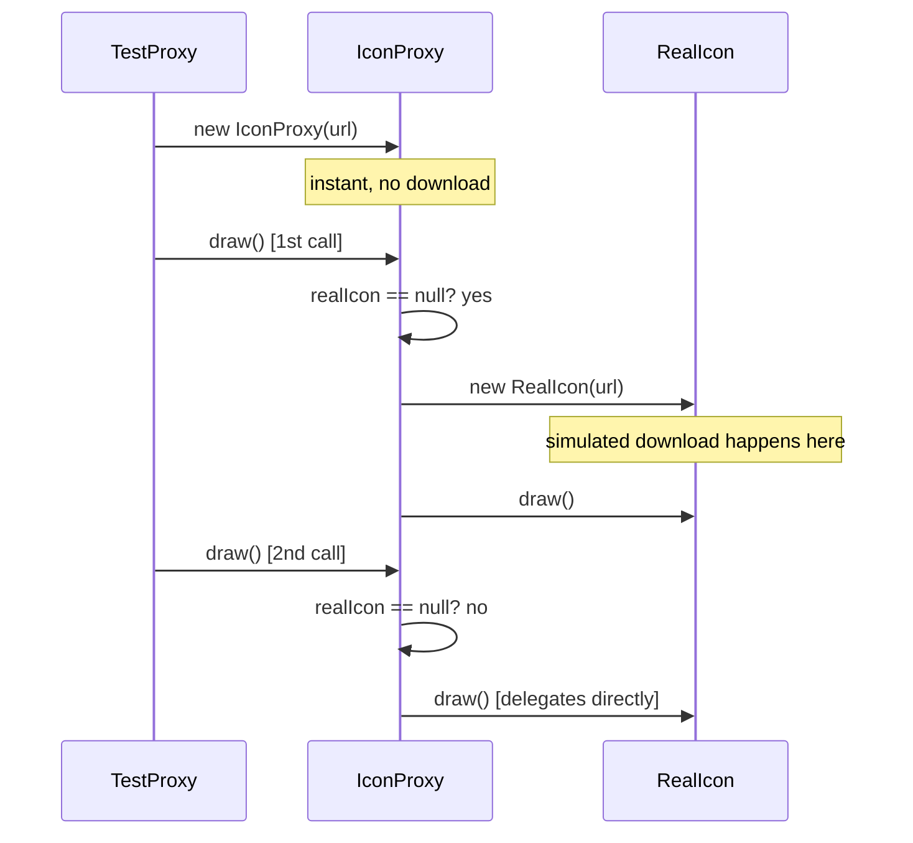

# Proxy Design Pattern

*Example: a virtual proxy for album cover images, from Head First Design Patterns.*

## What it is
Proxy provides a surrogate or placeholder for another object to control
access to it. A **virtual proxy** specifically controls access to an object
that's expensive to create, by deferring that creation until it's genuinely needed.

## Problem it solves
Displaying an album's page might need to show a dozen cover images, but
downloading all of them immediately (even the ones the user scrolls past
without looking at) wastes time and bandwidth. If the client held a
`RealIcon` directly, that download cost would be paid the moment the object
is constructed — no way to defer it. A virtual proxy fixes this: the client
gets an object that satisfies the same `Icon` interface instantly, and the
real, expensive `RealIcon` is only constructed the first time `draw()` is
actually called on it.

## Participants (mapped to this package)

| Role                | Type      | Class in this package |
|---------------------|-----------|--------------------------|
| Subject              | interface | `Icon`                   |
| Real Subject         | class     | `RealIcon`                |
| Proxy                | class     | `IconProxy`                |
| Client               | class     | `TestProxy`                |

- **Subject (`Icon`)** — the common interface (`draw()`) both the real image
  and its proxy implement, so the client can't tell them apart by type.
- **Real Subject (`RealIcon`)** — the actual, expensive object; its
  constructor simulates the costly download, so just calling `new RealIcon(...)`
  is the expensive operation being deferred.
- **Proxy (`IconProxy`)** — implements `Icon` but holds only a `RealIcon`
  reference that starts out `null`. It creates the real object lazily, on the
  first `draw()` call, then delegates every call (including that first one)
  to it.
- **Client (`TestProxy`)** — creates `IconProxy` instances freely (cheap,
  instant), and only pays the download cost when it actually calls `draw()`.

## Diagrams

*These two diagrams are meant to be readable on their own — every box is
labeled with its pattern role, and notes spell out what each one actually
does, so you shouldn't need the prose above to follow them.*

### UML class diagram



**How to read this:** `IconProxy` and `RealIcon` both implement `Icon`, so a
client holding an `Icon` reference genuinely cannot tell which one it has.
The only difference lives inside `IconProxy.draw()`: it checks whether
`realIcon` has been built yet, builds it only the first time, then hands off
to it — that one `null` check is the entire pattern.

### Workflow (sequence diagram)



## Architecture / Flow

```
                    Icon (Subject, interface)
                    ---------------------------------
                    + draw()
                       ▲                    ▲
                       │ implements          │ implements
                   RealIcon               IconProxy
                 (expensive to build)   - realIcon : RealIcon (starts null)
                 draw() displays it     draw() {
                                            if (realIcon == null)
                                                realIcon = new RealIcon(...)  <-- lazy creation
                                            realIcon.draw()                  <-- delegation
                                        }
```

### Step-by-step call flow

1. `new IconProxy(url)` returns instantly — no download happens. The proxy
   just remembers the URL; `realIcon` is still `null`.
2. `coverOne.draw()` (first call) — `IconProxy.draw()` checks `realIcon`,
   finds it `null`, and only *now* constructs `new RealIcon(url)`, which is
   where the simulated download actually happens. It then delegates to
   `realIcon.draw()` to actually display it.
3. `coverOne.draw()` (second call) — `realIcon` is no longer `null`, so the
   proxy skips straight to delegation: `realIcon.draw()`. No second download.

```
new IconProxy(url)                      [instant — no download]

coverOne.draw()   [1st call]
IconProxy.draw()
   ├──> realIcon == null? yes
   ├──> realIcon = new RealIcon(url)    [download happens HERE, lazily]
   └──> realIcon.draw()                 [delegates]

coverOne.draw()   [2nd call]
IconProxy.draw()
   ├──> realIcon == null? no — already built
   └──> realIcon.draw()                 [delegates directly, no re-download]
```

## Why this matters (the point of the pattern)
- The client works with `Icon` the whole time — it never needs to know
  whether it's holding a `RealIcon` or an `IconProxy`, or that lazy loading
  is even happening.
- The expensive cost (the "download") is paid at most once, and only if the
  image is actually displayed — never for images the user never looks at.
- `RealIcon` itself stays completely unaware a proxy exists — it just does
  its one job.

## Quick recall checklist
- [ ] Subject → the shared interface real and proxy objects both implement (`Icon`)
- [ ] Real Subject → the expensive object being protected/deferred (`RealIcon`)
- [ ] Proxy → same interface as the real subject, creates it lazily, then delegates (`IconProxy`)
- [ ] Virtual proxy specifically → defers *creation* of an expensive object until first real use
- [ ] Client → depends only on the Subject interface, gets the deferred-creation benefit for free
